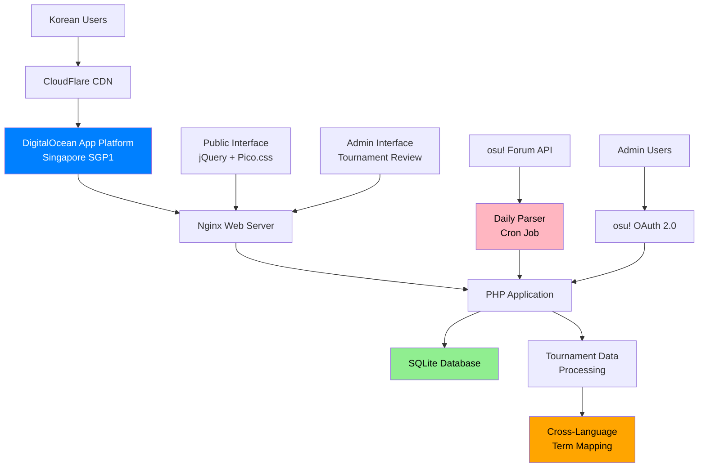
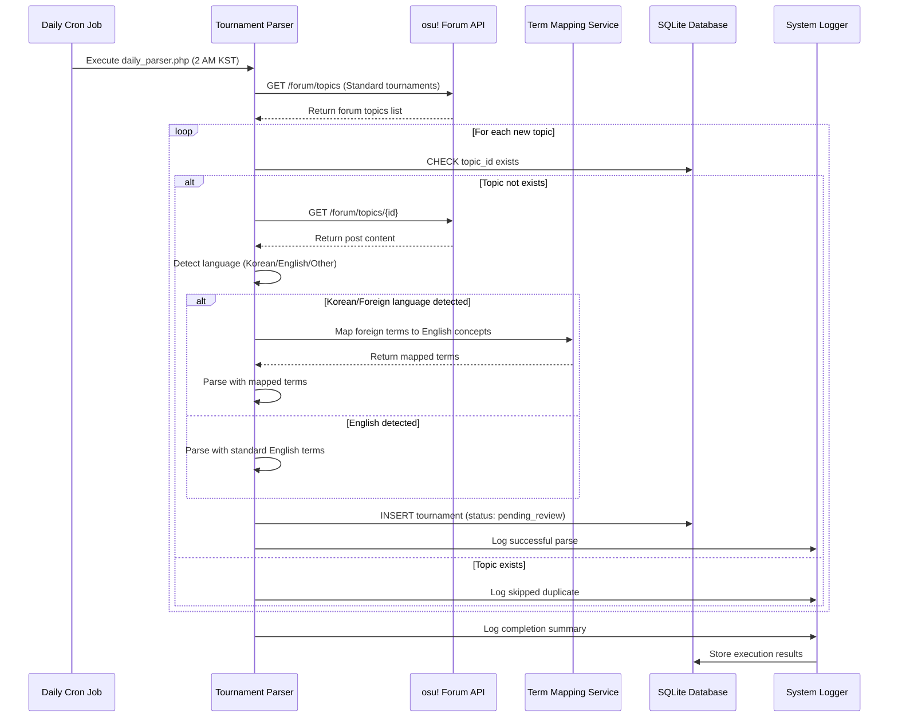
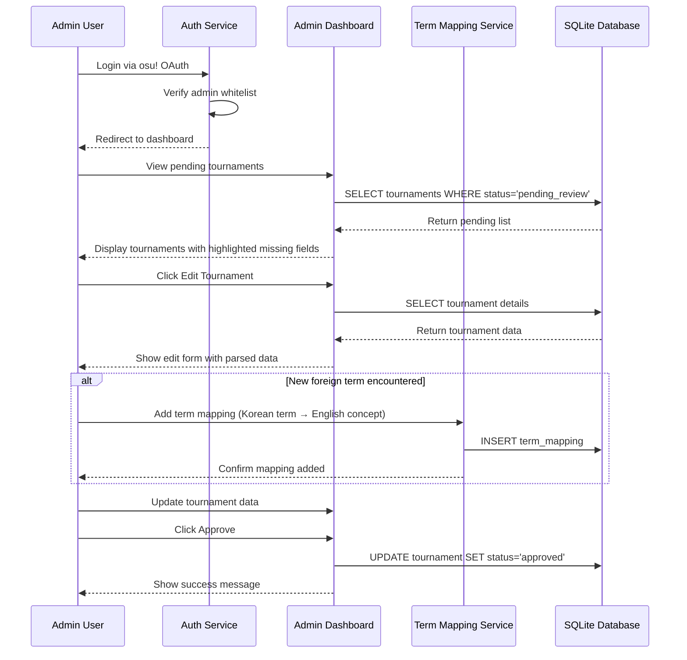
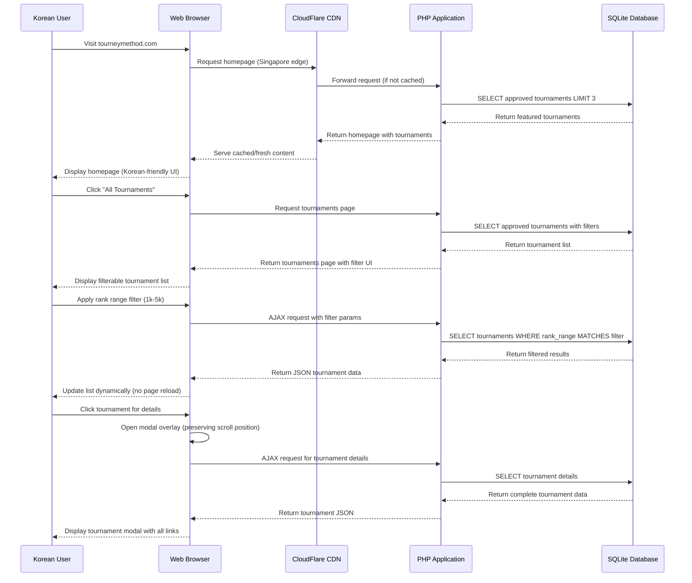
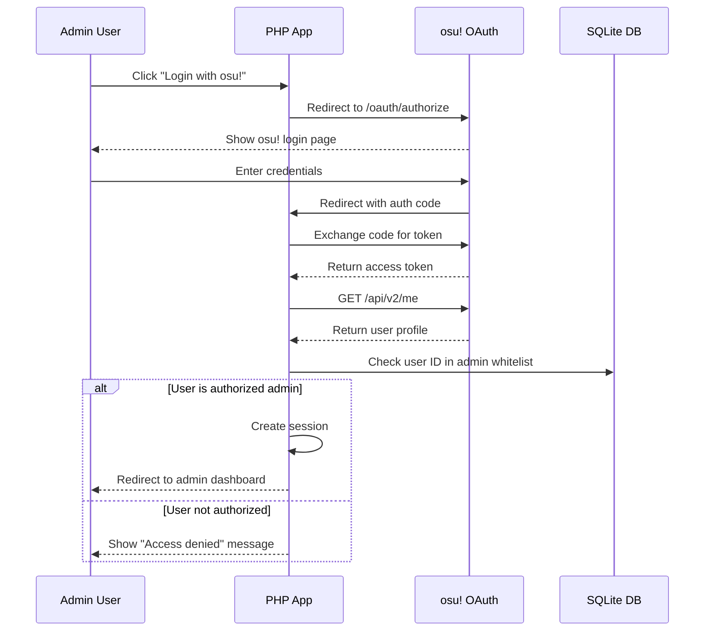
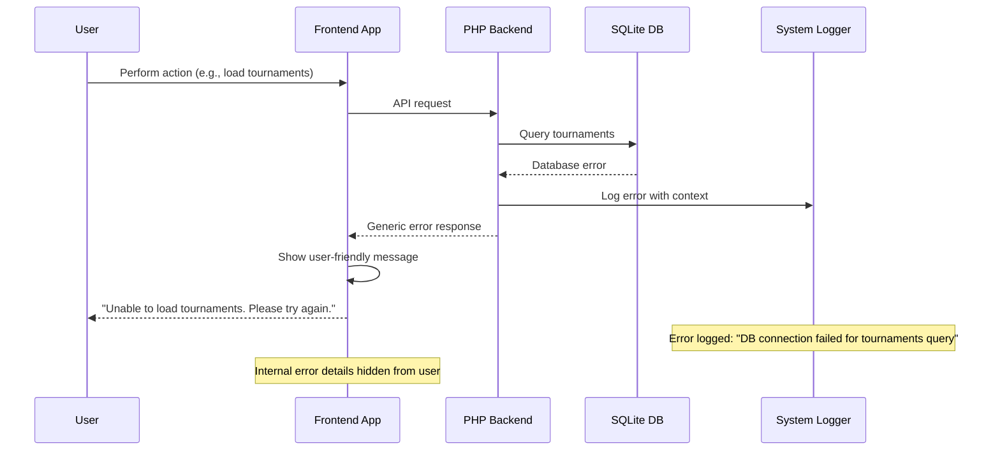

# Tourney Method Fullstack Architecture Document

This document outlines the complete fullstack architecture for Tourney Method, including backend systems, frontend implementation, and their integration. It serves as the single source of truth for AI-driven development, ensuring consistency across the entire technology stack.

This unified approach combines what would traditionally be separate backend and frontend architecture documents, streamlining the development process for modern fullstack applications where these concerns are increasingly intertwined.

## Starter Template or Existing Project

**N/A - Greenfield project**

This is a greenfield project built from scratch using vanilla PHP, jQuery, and SQLite. The technology stack is deliberately constrained to avoid framework complexity while maintaining a clear evolution path toward modern frameworks as the project scales.

**Technology Constraints:**
- Vanilla PHP (no frameworks initially)
- jQuery for frontend interactions  
- SQLite for data persistence
- Monorepo structure
- DigitalOcean App Platform deployment

**Evolution Path Planned:**
Monolith → Enhanced services → Framework adoption → Microservices (as project scales)

## Change Log

| Date | Version | Description | Author |
| :--- | :--- | :--- | :--- |
| 2025-09-05 | 1.0 | Initial comprehensive architecture | Winston (Architect) |

## High Level Architecture

### Technical Summary

Tourney Method is a traditional web application built with vanilla PHP and progressive enhancement, designed specifically for the Korean osu! tournament community. The architecture leverages DigitalOcean App Platform for managed deployment in Singapore, providing optimal latency for Korean users. The system integrates with osu! OAuth 2.0 for admin authentication and the osu! Forum API for automated tournament data parsing. 

The frontend uses jQuery with Pico.css for a lightweight, responsive experience that works across devices without heavy framework overhead. The backend implements a clean repository pattern with SQLite for data persistence, featuring advanced cross-language term mapping to handle tournaments posted in Korean, English, and other languages. This architecture achieves the PRD goals of automated tournament discovery, admin-curated data quality, and fast public tournament browsing for the Korean market.

### Platform and Infrastructure Choice

**Platform:** DigitalOcean App Platform
**Key Services:** Managed PHP runtime, Nginx web server, automatic SSL, built-in CDN, scheduled jobs
**Deployment Host and Regions:** Singapore (SGP1) for optimal Korean latency (30-60ms to Seoul/Busan)

**Platform Decision Rationale:**
- **Cost Efficiency:** $5/month vs $25/month for traditional droplet (60% savings)
- **Korean Market Optimization:** Singapore region provides best latency to Korea
- **Zero Server Management:** Automatic OS updates, security patches, scaling
- **Integrated Services:** SSL, CDN, monitoring, and scheduled jobs built-in
- **Git-based Deployment:** Direct deployment from GitHub repository

**Alternative Considered:** Traditional DigitalOcean droplet was rejected due to higher maintenance overhead and cost.

### Repository Structure

**Structure:** Monorepo with functional organization
**Monorepo Tool:** Native Git (no additional tooling required)
**Package Organization:** Functional separation (public/, src/, data/, config/, scripts/, tests/)

The monorepo approach simplifies development and deployment while maintaining clear separation of concerns through directory structure rather than separate repositories.

### High Level Architecture Diagram



### Architectural Patterns

- **Monolithic Architecture:** Single deployable unit with clear internal boundaries - _Rationale:_ Simplicity for solo developer, easy deployment and debugging, cost-effective for initial scale
- **Repository Pattern:** Abstract data access logic - _Rationale:_ Enables testing and future database migration flexibility from SQLite to PostgreSQL
- **Progressive Enhancement:** JavaScript enhances but doesn't replace core functionality - _Rationale:_ Accessibility, performance, and reliability for diverse user devices and network conditions
- **MVC Separation:** Clear separation of models, views, and controllers - _Rationale:_ Maintainability and organization despite not using a formal MVC framework
- **Service Layer Pattern:** Business logic encapsulated in service classes - _Rationale:_ Testability and reusability of core application logic
- **Cross-Language Processing:** Admin-managed term mapping for international tournaments - _Rationale:_ Handles Korean/English/multilingual tournament posts without AI/ML complexity

## Tech Stack

### Technology Stack Table

| Category | Technology | Version | Purpose | Rationale |
|----------|------------|---------|---------|-----------|
| Frontend Language | JavaScript | ES6+ | Progressive enhancement, DOM manipulation | Widely supported, no build process needed, works with jQuery |
| Frontend Framework | jQuery | 3.7+ | DOM manipulation, AJAX, progressive enhancement | Lightweight, no build process, proven reliability, easy debugging |
| UI Component Library | Pico.css | 2.0+ | Class-less CSS framework | Minimal overhead, automatic theming, no custom CSS needed |
| State Management | Browser Storage + jQuery | Native | Client-side state persistence | Simple approach, no complex state management needed for current scope |
| Backend Language | PHP | 8.1+ | Server-side logic, templating | Zero configuration, built-in web server, DigitalOcean App Platform optimized |
| Backend Framework | Vanilla PHP | Native | Application structure and routing | No framework overhead, full control, easier debugging, faster deployment |
| API Style | REST | HTTP/1.1 | Public and admin endpoints | Simple, well-understood, cacheable, works with any client |
| Database | SQLite | 3.40+ | Data persistence and querying | File-based, zero configuration, easy backups, perfect for current scale |
| Cache | SQLite WAL mode | Built-in | Query result caching | Built into SQLite, no additional infrastructure needed |
| File Storage | External hosting | CDN | Tournament banner images | No local storage needed, CDN benefits, reduced server load |
| Authentication | osu! OAuth 2.0 | v2 | Admin authentication and authorization | Secure, familiar to target users, official osu! integration |
| Frontend Testing | Manual + Browser DevTools | Native | UI/UX validation and debugging | Appropriate for progressive enhancement approach, visual testing focus |
| Backend Testing | PHPUnit | 10+ | Unit and integration testing | PHP standard, supports mocking, good CI integration |
| E2E Testing | Manual Testing | Native | Cross-browser functionality validation | Cost-effective for current scope, thorough coverage |
| Build Tool | None | - | Direct file deployment | No build complexity, instant deployment, easier debugging |
| Bundler | None | - | Direct file inclusion | Simple approach, HTTP/2 makes multiple files efficient |
| IaC Tool | DigitalOcean App Spec | YAML | Infrastructure as code | Platform native, simple configuration, version controlled |
| CI/CD | DigitalOcean App Platform | Git-based | Automated deployment pipeline | Integrated with platform, zero configuration needed |
| Monitoring | DigitalOcean Insights | Platform | Performance and error monitoring | Built-in, no additional setup, comprehensive metrics |
| Logging | PHP error_log + Platform | Native | Error tracking and debugging | Platform aggregation, no additional services needed |
| CSS Framework | Pico.css | 2.0+ | Responsive styling and theming | Class-less approach, automatic dark/light themes, minimal overhead |

**Korean Deployment Specifics:**
- **Timezone:** Asia/Seoul (KST) for all timestamps
- **Character Encoding:** UTF-8 throughout the application
- **CDN Configuration:** CloudFlare CDN with Singapore edge servers
- **Database Collation:** UTF8_UNICODE_CI for proper Korean character handling

**Evolution Strategy:**
- Phase 1: Current vanilla stack
- Phase 2: jQuery → Alpine.js for enhanced reactivity
- Phase 3: Alpine.js → Vue.js for complex UI components
- Phase 4: SQLite → PostgreSQL for advanced features
- Phase 5: Monolith → Microservices for scale

## Data Models

### Tournament
**Purpose:** Core entity representing osu! tournaments with all parsed and admin-curated information

**Key Attributes:**
- id: integer - Primary key for tournament identification
- topic_id: integer - osu! forum topic ID (unique constraint)
- title: string - Tournament display name
- host: string - Tournament organizer username
- mode: string - Game mode (Standard, Taiko, Catch, Mania)
- banner_url: string - Tournament banner image URL
- rank_range: string - Eligible player rank range
- registration_status: enum - Open, Closed, Ongoing registration status
- created_at: timestamp - Tournament creation time (KST)
- updated_at: timestamp - Last modification time (KST)
- status: enum - pending_review, approved, rejected admin workflow status
- language_detected: string - Detected primary language of forum post

```typescript
interface Tournament {
  id: number;
  topic_id: number;
  title: string;
  host: string;
  mode: 'Standard' | 'Taiko' | 'Catch' | 'Mania';
  banner_url?: string;
  rank_range: string;
  registration_status: 'Open' | 'Closed' | 'Ongoing';
  registration_link?: string;
  discord_link?: string;
  sheet_link?: string;
  stream_link?: string;
  forum_link: string;
  badge_prize: boolean;
  start_date?: Date;
  end_date?: Date;
  created_at: Date;
  updated_at: Date;
  status: 'pending_review' | 'approved' | 'rejected';
  language_detected: string;
  parsed_terms_used: string; // JSON array of terms used during parsing
}
```

**Relationships:**
- One tournament has many parsed data entries (historical parsing attempts)
- One tournament is created by one admin user (approval tracking)

### AdminUser
**Purpose:** Authorized users who can review and approve parsed tournament data

**Key Attributes:**
- id: integer - Primary key for admin identification
- osu_user_id: integer - osu! user ID from OAuth
- username: string - osu! username
- last_login: timestamp - Last authentication time
- permissions: string - Admin permission level
- created_at: timestamp - Admin account creation time (KST)

```typescript
interface AdminUser {
  id: number;
  osu_user_id: number;
  username: string;
  last_login: Date;
  permissions: 'admin' | 'moderator';
  created_at: Date;
}
```

**Relationships:**
- One admin user approves many tournaments
- One admin user creates many system log entries

### SystemLog
**Purpose:** Comprehensive logging for parser execution, errors, and admin actions

**Key Attributes:**
- id: integer - Primary key for log entry identification
- level: enum - Log severity level
- message: text - Human-readable log message
- context: text - JSON context data for debugging
- timestamp: timestamp - Log entry creation time (KST)
- component: string - System component that generated the log

```typescript
interface SystemLog {
  id: number;
  level: 'error' | 'warning' | 'info' | 'debug';
  message: string;
  context: string; // JSON string with contextual data
  timestamp: Date;
  component: 'parser' | 'auth' | 'admin' | 'api';
}
```

**Relationships:**
- System logs reference admin users for admin action tracking
- System logs reference tournaments for parsing-related entries

### TermMapping
**Purpose:** Cross-language term mapping for parsing tournaments in Korean, English, and other languages

**Key Attributes:**
- id: integer - Primary key for term mapping identification
- language: string - ISO language code
- foreign_term: string - Non-English term found in tournaments
- english_concept: string - English equivalent concept
- confidence: float - Admin confidence in mapping accuracy
- usage_count: integer - Number of times term has been encountered
- created_by: integer - Admin who created the mapping
- created_at: timestamp - Mapping creation time (KST)

```typescript
interface TermMapping {
  id: number;
  language: string; // 'ko', 'ja', 'zh', 'ru', etc.
  foreign_term: string;
  english_concept: string;
  confidence: number; // 0.0 to 1.0
  usage_count: number;
  created_by: number; // AdminUser.id
  created_at: Date;
  variations: string; // JSON array of term variations
}
```

**Relationships:**
- One term mapping belongs to one admin user (created_by)
- Term mappings are used by parser to understand foreign language tournaments

## API Specification

### REST API Specification

```yaml
openapi: 3.0.0
info:
  title: Tourney Method API
  version: 1.0.0
  description: API for osu! tournament discovery and management
servers:
  - url: https://tourneymethod.com/api
    description: Production server (Korean-optimized)
  - url: http://localhost:8000/api
    description: Development server

components:
  schemas:
    Tournament:
      type: object
      properties:
        id:
          type: integer
          example: 123
        topic_id:
          type: integer
          example: 1867432
        title:
          type: string
          example: "Korean Spring Tournament 2025"
        host:
          type: string
          example: "TournamentHost"
        mode:
          type: string
          enum: [Standard, Taiko, Catch, Mania]
          example: "Standard"
        banner_url:
          type: string
          format: uri
          example: "https://example.com/banner.jpg"
        rank_range:
          type: string
          example: "1k-5k"
        registration_status:
          type: string
          enum: [Open, Closed, Ongoing]
          example: "Open"
        registration_link:
          type: string
          format: uri
        discord_link:
          type: string
          format: uri
        created_at:
          type: string
          format: date-time
          example: "2025-09-05T14:30:00+09:00"
        language_detected:
          type: string
          example: "ko"
    
    ErrorResponse:
      type: object
      properties:
        error:
          type: object
          properties:
            code:
              type: string
              example: "TOURNAMENT_NOT_FOUND"
            message:
              type: string
              example: "Tournament not found"
            timestamp:
              type: string
              format: date-time
            request_id:
              type: string
              example: "req_123456789"

paths:
  /tournaments:
    get:
      summary: List approved tournaments
      parameters:
        - name: mode
          in: query
          schema:
            type: string
            enum: [Standard, Taiko, Catch, Mania]
        - name: rank_range
          in: query
          schema:
            type: string
        - name: status
          in: query
          schema:
            type: string
            enum: [Open, Closed, Ongoing]
        - name: limit
          in: query
          schema:
            type: integer
            default: 10
            maximum: 50
        - name: offset
          in: query
          schema:
            type: integer
            default: 0
      responses:
        '200':
          description: List of tournaments
          content:
            application/json:
              schema:
                type: object
                properties:
                  tournaments:
                    type: array
                    items:
                      $ref: '#/components/schemas/Tournament'
                  total:
                    type: integer
                  limit:
                    type: integer
                  offset:
                    type: integer
  
  /tournaments/{id}:
    get:
      summary: Get tournament details
      parameters:
        - name: id
          in: path
          required: true
          schema:
            type: integer
      responses:
        '200':
          description: Tournament details
          content:
            application/json:
              schema:
                $ref: '#/components/schemas/Tournament'
        '404':
          description: Tournament not found
          content:
            application/json:
              schema:
                $ref: '#/components/schemas/ErrorResponse'

  /admin/tournaments/pending:
    get:
      summary: List tournaments pending review (Admin only)
      security:
        - osu_oauth: []
      responses:
        '200':
          description: Pending tournaments
          content:
            application/json:
              schema:
                type: array
                items:
                  $ref: '#/components/schemas/Tournament'
        '401':
          description: Unauthorized

  /admin/tournaments/{id}/approve:
    post:
      summary: Approve tournament (Admin only)
      security:
        - osu_oauth: []
      parameters:
        - name: id
          in: path
          required: true
          schema:
            type: integer
      responses:
        '200':
          description: Tournament approved
        '401':
          description: Unauthorized
        '404':
          description: Tournament not found

securitySchemes:
  osu_oauth:
    type: oauth2
    flows:
      authorizationCode:
        authorizationUrl: https://osu.ppy.sh/oauth/authorize
        tokenUrl: https://osu.ppy.sh/oauth/token
        scopes:
          identify: Read user identification
```

**Korean Considerations:**
- All timestamps returned in KST timezone (+09:00)
- UTF-8 encoding enforced for all text fields
- Error messages support Korean characters
- API documentation available in both English and Korean

## Components

### TournamentParser
**Responsibility:** Parse osu! forum posts to extract structured tournament data with cross-language support

**Key Interfaces:**
- parseForumPost(topic_id): ParsedTournament
- extractTerms(post_content, language): TermExtractionResult
- mapForeignTerms(terms, language): MappedTerms

**Dependencies:** osu! Forum API, TermMappingService, SystemLog

**Technology Stack:** Vanilla PHP with regex parsing, HTML DOM parser, UTF-8 text processing

### AdminDashboard
**Responsibility:** Provide admin interface for tournament review, approval, and term mapping management

**Key Interfaces:**
- displayPendingTournaments(): TournamentList
- showEditForm(tournament_id): EditForm
- manageTerm Mappings(): TermMappingInterface

**Dependencies:** AuthService, TournamentRepository, TermMappingRepository

**Technology Stack:** PHP templating with Pico.css styling, jQuery for form interactions

### PublicInterface
**Responsibility:** Display public tournament list with filtering, search, and detail modals

**Key Interfaces:**
- renderTournamentList(filters): TournamentGrid
- showTournamentModal(tournament_id): Modal
- applyFilters(criteria): FilteredResults

**Dependencies:** TournamentRepository, FilterService

**Technology Stack:** Progressive enhancement with jQuery, responsive Pico.css design, modal overlays

### FilterService
**Responsibility:** Handle complex tournament filtering with Korean language support

**Key Interfaces:**
- applyRankRangeFilter(tournaments, range): FilteredTournaments
- searchTournaments(query, language): SearchResults
- buildFilterSQL(criteria): SQLQuery

**Dependencies:** TournamentRepository, Database utilities

**Technology Stack:** PHP with SQLite full-text search, UTF-8 collation support

### TermMappingService
**Responsibility:** Manage cross-language term mapping for international tournament parsing

**Key Interfaces:**
- mapTerm(foreign_term, language): english_concept
- addTermMapping(term, concept, confidence): TermMapping
- getLanguageStatistics(): LanguageStats

**Dependencies:** TermMappingRepository, AdminUser validation

**Technology Stack:** PHP with Unicode text processing, statistical term frequency analysis

## External APIs

### osu! Forum API
- **Purpose:** Retrieve tournament forum posts for automated parsing
- **Documentation:** https://osu.ppy.sh/docs/index.html#forum
- **Base URL(s):** https://osu.ppy.sh/api/v2/
- **Authentication:** OAuth 2.0 client credentials
- **Rate Limits:** 1000 requests per hour

**Key Endpoints Used:**
- `GET /forum/topics` - List tournament topics
- `GET /forum/topics/{id}` - Get specific tournament post content

**Integration Notes:** Daily parser respects rate limits, implements exponential backoff for failures, caches responses to minimize API calls

### osu! OAuth 2.0 API
- **Purpose:** Admin authentication and user verification
- **Documentation:** https://osu.ppy.sh/docs/index.html#authentication
- **Base URL(s):** https://osu.ppy.sh/oauth/
- **Authentication:** OAuth 2.0 authorization code flow
- **Rate Limits:** Standard OAuth limits apply

**Key Endpoints Used:**
- `POST /oauth/authorize` - Authorization endpoint
- `POST /oauth/token` - Token exchange endpoint
- `GET /api/v2/me` - Get authenticated user details

**Integration Notes:** Secure token storage, automatic token refresh, admin whitelist verification against osu! user IDs

## Core Workflows

### Daily Tournament Parsing with Language Fallback



### Admin Tournament Review and Term Mapping



### Public Tournament Discovery Flow



## Database Schema

```sql
-- Core tournament data with Korean language support
CREATE TABLE tournaments (
    id INTEGER PRIMARY KEY AUTOINCREMENT,
    topic_id INTEGER UNIQUE NOT NULL,
    title TEXT NOT NULL,
    host TEXT NOT NULL,
    mode TEXT NOT NULL CHECK (mode IN ('Standard', 'Taiko', 'Catch', 'Mania')),
    banner_url TEXT,
    rank_range TEXT NOT NULL,
    registration_status TEXT NOT NULL CHECK (registration_status IN ('Open', 'Closed', 'Ongoing')),
    registration_link TEXT,
    discord_link TEXT,
    sheet_link TEXT,
    stream_link TEXT,
    forum_link TEXT NOT NULL,
    badge_prize BOOLEAN DEFAULT 0,
    start_date TEXT, -- ISO 8601 format with KST timezone
    end_date TEXT,
    created_at TEXT NOT NULL DEFAULT CURRENT_TIMESTAMP,
    updated_at TEXT NOT NULL DEFAULT CURRENT_TIMESTAMP,
    status TEXT NOT NULL DEFAULT 'pending_review' CHECK (status IN ('pending_review', 'approved', 'rejected')),
    language_detected TEXT NOT NULL DEFAULT 'en',
    parsed_terms_used TEXT -- JSON array of terms used during parsing
);

-- Admin users authenticated via osu! OAuth
CREATE TABLE admin_users (
    id INTEGER PRIMARY KEY AUTOINCREMENT,
    osu_user_id INTEGER UNIQUE NOT NULL,
    username TEXT NOT NULL,
    last_login TEXT NOT NULL,
    permissions TEXT NOT NULL DEFAULT 'admin' CHECK (permissions IN ('admin', 'moderator')),
    created_at TEXT NOT NULL DEFAULT CURRENT_TIMESTAMP
);

-- Comprehensive system logging
CREATE TABLE system_logs (
    id INTEGER PRIMARY KEY AUTOINCREMENT,
    level TEXT NOT NULL CHECK (level IN ('error', 'warning', 'info', 'debug')),
    message TEXT NOT NULL,
    context TEXT, -- JSON context data
    timestamp TEXT NOT NULL DEFAULT CURRENT_TIMESTAMP,
    component TEXT NOT NULL CHECK (component IN ('parser', 'auth', 'admin', 'api')),
    admin_user_id INTEGER,
    tournament_id INTEGER,
    FOREIGN KEY (admin_user_id) REFERENCES admin_users(id),
    FOREIGN KEY (tournament_id) REFERENCES tournaments(id)
);

-- Cross-language term mapping for international tournaments
CREATE TABLE term_mappings (
    id INTEGER PRIMARY KEY AUTOINCREMENT,
    language TEXT NOT NULL, -- ISO language code (ko, ja, zh, ru, etc.)
    foreign_term TEXT NOT NULL,
    english_concept TEXT NOT NULL,
    confidence REAL NOT NULL DEFAULT 1.0 CHECK (confidence >= 0.0 AND confidence <= 1.0),
    usage_count INTEGER NOT NULL DEFAULT 1,
    variations TEXT, -- JSON array of term variations
    created_by INTEGER NOT NULL,
    created_at TEXT NOT NULL DEFAULT CURRENT_TIMESTAMP,
    FOREIGN KEY (created_by) REFERENCES admin_users(id),
    UNIQUE (language, foreign_term)
);

-- Language usage statistics for data-driven term mapping priorities
CREATE TABLE language_statistics (
    id INTEGER PRIMARY KEY AUTOINCREMENT,
    language TEXT NOT NULL,
    total_tournaments INTEGER NOT NULL DEFAULT 0,
    successful_parses INTEGER NOT NULL DEFAULT 0,
    failed_parses INTEGER NOT NULL DEFAULT 0,
    last_updated TEXT NOT NULL DEFAULT CURRENT_TIMESTAMP,
    UNIQUE (language)
);

-- Performance optimization indexes
CREATE INDEX idx_tournaments_status ON tournaments(status);
CREATE INDEX idx_tournaments_mode_status ON tournaments(mode, status);
CREATE INDEX idx_tournaments_rank_status ON tournaments(rank_range, status);
CREATE INDEX idx_tournaments_language ON tournaments(language_detected);
CREATE INDEX idx_system_logs_timestamp ON system_logs(timestamp);
CREATE INDEX idx_system_logs_component ON system_logs(component);
CREATE INDEX idx_term_mappings_language ON term_mappings(language);
CREATE INDEX idx_term_mappings_usage ON term_mappings(usage_count DESC);

-- SQLite Performance Configuration
PRAGMA journal_mode = WAL;
PRAGMA synchronous = NORMAL;
PRAGMA cache_size = 10000;
PRAGMA temp_store = memory;
PRAGMA mmap_size = 268435456;

-- UTF-8 encoding enforcement for Korean characters
PRAGMA encoding = 'UTF-8';
```

**Korean Language Considerations:**
- All TEXT fields use UTF-8 encoding for proper Korean character support
- Collation set to handle Korean sorting and comparison correctly
- Foreign key relationships maintain data integrity across language boundaries
- JSON fields store arrays of Korean/English term variations

**Evolution Path to PostgreSQL:**
When transitioning to PostgreSQL for enhanced features:
```sql
-- Enhanced PostgreSQL schema additions
ALTER TABLE tournaments ADD COLUMN full_text_search tsvector;
CREATE INDEX tournaments_fts_idx ON tournaments USING gin(full_text_search);

-- JSON columns for structured data
ALTER TABLE tournaments ADD COLUMN mappool_data jsonb;
ALTER TABLE term_mappings ADD COLUMN context_data jsonb;
```

## Frontend Architecture

### Component Architecture

#### Component Organization
```
public/assets/js/
├── main.js                 # Core application initialization
├── components/
│   ├── TournamentCard.js   # Tournament display component
│   ├── FilterPanel.js      # Tournament filtering interface
│   ├── ModalViewer.js      # Tournament detail modal
│   └── Pagination.js       # Results pagination controls
├── services/
│   ├── ApiClient.js        # REST API communication
│   ├── FilterService.js    # Client-side filtering logic
│   └── StorageService.js   # Browser storage management
└── utils/
    ├── KoreanUtils.js      # Korean text processing utilities
    └── DateUtils.js        # KST timezone handling
```

#### Component Template
```typescript
// TournamentCard.js - Progressive Enhancement Component
const TournamentCard = {
    // Component initialization
    init: function(element, options = {}) {
        this.element = $(element);
        this.options = $.extend({}, this.defaults, options);
        this.bindEvents();
        this.loadTournamentData();
    },

    // Default configuration
    defaults: {
        modalTarget: '#tournament-modal',
        apiEndpoint: '/api/tournaments',
        lazyLoadImages: true
    },

    // Event binding for progressive enhancement
    bindEvents: function() {
        this.element.on('click', '.tournament-title', this.handleTitleClick.bind(this));
        this.element.on('click', '.tournament-card', this.handleCardClick.bind(this));
        this.element.on('error', 'img', this.handleImageError.bind(this));
    },

    // Korean-specific text handling
    handleKoreanText: function(text) {
        return KoreanUtils.processText(text);
    },

    // Graceful fallback for JavaScript disabled
    handleNoScript: function() {
        // Ensure all functionality works without JavaScript
        this.element.find('a').attr('target', '_blank');
    }
};
```

### State Management Architecture

#### State Structure
```typescript
// Client-side state management with browser storage
interface AppState {
  filters: {
    mode: string;
    rankRange: string;
    registrationStatus: string;
    searchQuery: string;
  };
  tournaments: {
    list: Tournament[];
    total: number;
    loading: boolean;
    error: string | null;
  };
  ui: {
    currentPage: number;
    selectedTournament: number | null;
    modalOpen: boolean;
    filtersExpanded: boolean;
  };
  user: {
    preferences: {
      theme: 'light' | 'dark' | 'auto';
      language: 'ko' | 'en';
      pageSize: 10 | 25 | 50;
    };
  };
}
```

#### State Management Patterns
- **Centralized State:** Single state object managed through jQuery patterns
- **Local Storage Persistence:** User preferences and filter state persist across sessions
- **Event-Driven Updates:** Components communicate through custom jQuery events
- **Optimistic UI Updates:** Immediate UI feedback with server-side validation
- **Korean Language State:** Separate handling for Korean vs English content

### Routing Architecture

#### Route Organization
```
public/
├── index.php               # Homepage (featured tournaments)
├── tournaments.php         # All tournaments with filtering
├── tournament.php          # Individual tournament details
└── admin/
    ├── index.php          # Admin dashboard
    ├── edit.php           # Tournament editing
    └── logs.php           # System logs viewer
```

#### Protected Route Pattern
```typescript
// Admin route protection with osu! OAuth
const AdminRouteGuard = {
    checkAuthentication: function() {
        return fetch('/api/auth/check', {
            credentials: 'same-origin'
        }).then(response => response.json());
    },

    redirectToLogin: function() {
        window.location.href = '/admin/login.php?return=' + 
            encodeURIComponent(window.location.pathname);
    },

    init: function() {
        this.checkAuthentication().then(auth => {
            if (!auth.authenticated || !auth.isAdmin) {
                this.redirectToLogin();
            }
        });
    }
};
```

### Frontend Services Layer

#### API Client Setup
```typescript
// RESTful API client with Korean timezone handling
const ApiClient = {
    baseUrl: '/api',
    
    // Default request configuration
    defaults: {
        headers: {
            'Content-Type': 'application/json',
            'Accept': 'application/json',
            'X-Timezone': 'Asia/Seoul'
        },
        credentials: 'same-origin'
    },

    // Korean-aware request handling
    request: function(endpoint, options = {}) {
        const url = this.baseUrl + endpoint;
        const config = $.extend(true, {}, this.defaults, options);
        
        return fetch(url, config)
            .then(response => {
                if (!response.ok) {
                    throw new Error(`API Error: ${response.status}`);
                }
                return response.json();
            })
            .then(data => {
                // Convert timestamps to KST
                return this.processKoreanTimestamps(data);
            });
    },

    // KST timezone processing
    processKoreanTimestamps: function(data) {
        // Convert UTC timestamps to KST display format
        return DateUtils.convertToKST(data);
    }
};
```

#### Service Example
```typescript
// Tournament service with filtering and search
const TournamentService = {
    // Get tournaments with Korean language support
    getTournaments: function(filters = {}) {
        const params = new URLSearchParams({
            mode: filters.mode || '',
            rank_range: filters.rankRange || '',
            status: filters.registrationStatus || '',
            search: filters.searchQuery || '',
            limit: filters.pageSize || 10,
            offset: (filters.page - 1) * (filters.pageSize || 10)
        });

        return ApiClient.request(`/tournaments?${params}`);
    },

    // Search with Korean text support
    searchTournaments: function(query, language = 'auto') {
        const searchParams = {
            q: query,
            lang: language === 'auto' ? KoreanUtils.detectLanguage(query) : language
        };

        return ApiClient.request('/tournaments/search', {
            method: 'POST',
            body: JSON.stringify(searchParams)
        });
    },

    // Get tournament details
    getTournamentDetails: function(id) {
        return ApiClient.request(`/tournaments/${id}`);
    }
};
```

## Backend Architecture

### Service Architecture

#### Traditional Server Architecture

##### Controller/Route Organization
```
src/
├── controllers/
│   ├── HomeController.php          # Homepage tournament display
│   ├── TournamentController.php    # Public tournament operations
│   ├── ApiController.php           # REST API endpoints
│   └── AdminController.php         # Admin panel operations
├── middleware/
│   ├── AuthMiddleware.php          # osu! OAuth verification
│   ├── CSRFMiddleware.php          # CSRF token validation
│   └── RateLimitMiddleware.php     # Basic rate limiting
└── routes/
    ├── web.php                     # Public web routes
    ├── api.php                     # API routes
    └── admin.php                   # Admin routes
```

##### Controller Template
```php
<?php
// TournamentController.php - Main tournament operations
class TournamentController {
    private $tournamentRepository;
    private $filterService;
    private $validationService;

    public function __construct(
        TournamentRepository $tournamentRepository,
        FilterService $filterService,
        ValidationService $validationService
    ) {
        $this->tournamentRepository = $tournamentRepository;
        $this->filterService = $filterService;
        $this->validationService = $validationService;
    }

    // Display all tournaments with filtering
    public function index() {
        $filters = $this->validationService->validateFilters($_GET);
        $tournaments = $this->tournamentRepository->findByFilters($filters);
        
        $data = [
            'tournaments' => $tournaments,
            'filters' => $filters,
            'total' => count($tournaments),
            'title' => 'osu! Tournament Discovery'
        ];
        
        return $this->renderTemplate('pages/tournaments-list.php', $data);
    }

    // API endpoint for AJAX requests
    public function api() {
        header('Content-Type: application/json; charset=utf-8');
        
        try {
            $filters = $this->validationService->validateFilters($_GET);
            $tournaments = $this->tournamentRepository->findByFilters($filters);
            
            // Convert timestamps to KST for Korean users
            $tournaments = array_map(function($tournament) {
                return $this->formatForKoreanTimezone($tournament);
            }, $tournaments);
            
            echo json_encode([
                'tournaments' => $tournaments,
                'total' => count($tournaments),
                'success' => true
            ], JSON_UNESCAPED_UNICODE);
        } catch (Exception $e) {
            http_response_code(500);
            echo json_encode([
                'error' => 'Failed to load tournaments',
                'success' => false
            ], JSON_UNESCAPED_UNICODE);
        }
    }

    // Korean timezone formatting
    private function formatForKoreanTimezone($tournament) {
        $tournament['created_at_kst'] = 
            DateHelper::convertToKST($tournament['created_at']);
        return $tournament;
    }

    // Template rendering with Korean character support
    private function renderTemplate($template, $data = []) {
        extract($data);
        ob_start();
        include "src/templates/{$template}";
        return ob_get_clean();
    }
}
?>
```

### Database Architecture

#### Schema Design
```sql
-- Core tournament schema with Korean optimization
CREATE TABLE tournaments (
    id INTEGER PRIMARY KEY AUTOINCREMENT,
    topic_id INTEGER UNIQUE NOT NULL,
    title TEXT NOT NULL COLLATE NOCASE,
    host TEXT NOT NULL,
    mode TEXT NOT NULL,
    banner_url TEXT,
    rank_range TEXT NOT NULL,
    registration_status TEXT NOT NULL,
    -- Korean-specific fields
    language_detected TEXT NOT NULL DEFAULT 'en',
    parsed_terms_used TEXT, -- JSON array
    -- Timestamp fields in KST
    created_at TEXT NOT NULL DEFAULT CURRENT_TIMESTAMP,
    updated_at TEXT NOT NULL DEFAULT CURRENT_TIMESTAMP,
    status TEXT NOT NULL DEFAULT 'pending_review'
);

-- Cross-language term mapping
CREATE TABLE term_mappings (
    id INTEGER PRIMARY KEY AUTOINCREMENT,
    language TEXT NOT NULL, -- 'ko', 'ja', 'zh', 'ru', etc.
    foreign_term TEXT NOT NULL,
    english_concept TEXT NOT NULL,
    confidence REAL NOT NULL DEFAULT 1.0,
    usage_count INTEGER NOT NULL DEFAULT 1,
    created_at TEXT NOT NULL DEFAULT CURRENT_TIMESTAMP
);

-- Full-text search optimization for Korean
CREATE VIRTUAL TABLE tournaments_fts USING fts5(
    title, host, content='tournaments', content_rowid='id'
);
```

#### Data Access Layer
```php
<?php
// Repository pattern with Korean language support
class TournamentRepository {
    private $db;
    
    public function __construct(DatabaseHelper $db) {
        $this->db = $db;
    }

    // Find tournaments with complex filtering
    public function findByFilters($filters = []) {
        $sql = "SELECT * FROM tournaments WHERE status = 'approved'";
        $params = [];

        // Mode filtering
        if (!empty($filters['mode'])) {
            $sql .= " AND mode = :mode";
            $params[':mode'] = $filters['mode'];
        }

        // Rank range filtering with Korean rank terms
        if (!empty($filters['rank_range'])) {
            $sql .= " AND rank_range LIKE :rank_range";
            $params[':rank_range'] = '%' . $filters['rank_range'] . '%';
        }

        // Korean text search support
        if (!empty($filters['search'])) {
            $sql .= " AND (title LIKE :search OR host LIKE :search)";
            $params[':search'] = '%' . $filters['search'] . '%';
        }

        // Order by creation date (KST)
        $sql .= " ORDER BY created_at DESC";
        
        // Pagination
        if (isset($filters['limit'])) {
            $sql .= " LIMIT :limit";
            $params[':limit'] = (int)$filters['limit'];
            
            if (isset($filters['offset'])) {
                $sql .= " OFFSET :offset";
                $params[':offset'] = (int)$filters['offset'];
            }
        }

        return $this->db->query($sql, $params);
    }

    // Korean language-aware tournament creation
    public function create($data) {
        $sql = "INSERT INTO tournaments (
            topic_id, title, host, mode, banner_url, rank_range,
            registration_status, language_detected, parsed_terms_used,
            created_at, updated_at
        ) VALUES (
            :topic_id, :title, :host, :mode, :banner_url, :rank_range,
            :registration_status, :language_detected, :parsed_terms_used,
            datetime('now', '+9 hours'), datetime('now', '+9 hours')
        )";

        return $this->db->execute($sql, [
            ':topic_id' => $data['topic_id'],
            ':title' => $data['title'],
            ':host' => $data['host'],
            ':mode' => $data['mode'],
            ':banner_url' => $data['banner_url'],
            ':rank_range' => $data['rank_range'],
            ':registration_status' => $data['registration_status'],
            ':language_detected' => $data['language_detected'] ?? 'en',
            ':parsed_terms_used' => json_encode($data['parsed_terms_used'] ?? [])
        ]);
    }
}
?>
```

### Authentication and Authorization

#### Auth Flow


#### Middleware/Guards
```php
<?php
// AuthMiddleware.php - osu! OAuth authentication
class AuthMiddleware {
    private $adminUserIds = [
        123456, // Main admin osu! user ID
        789012  // Secondary admin osu! user ID
    ];

    public function handle($request, $next) {
        session_start();

        // Check if user is authenticated
        if (!isset($_SESSION['osu_user_id'])) {
            return $this->redirectToLogin();
        }

        // Verify admin privileges
        if (!in_array($_SESSION['osu_user_id'], $this->adminUserIds)) {
            return $this->accessDenied();
        }

        // Update last activity
        $_SESSION['last_activity'] = time();

        return $next($request);
    }

    private function redirectToLogin() {
        $return_url = urlencode($_SERVER['REQUEST_URI']);
        header("Location: /admin/login.php?return={$return_url}");
        exit;
    }

    private function accessDenied() {
        http_response_code(403);
        include 'src/templates/errors/403.php';
        exit;
    }

    // CSRF protection for admin forms
    public function validateCSRF() {
        if ($_SERVER['REQUEST_METHOD'] === 'POST') {
            $token = $_POST['csrf_token'] ?? '';
            if (!hash_equals($_SESSION['csrf_token'] ?? '', $token)) {
                throw new SecurityException('CSRF token mismatch');
            }
        }
    }
}
?>
```

## Unified Project Structure

**Monorepo Organization:** Single repository with functional separation and vanilla PHP structure optimized for Korean deployment and future evolution.

### Directory Structure

```
tourney-method/
├── .bmad-core/                    # BMAD framework files (not deployed)
│   ├── tasks/
│   ├── templates/
│   └── core-config.yaml
├── docs/                          # Documentation (not deployed)
│   ├── prd.md
│   ├── architecture.md
│   └── front-end-spec.md
├── public/                        # Web root - all publicly accessible files
│   ├── index.php                  # Homepage with featured tournaments
│   ├── tournaments.php            # All tournaments page with filtering
│   ├── tournament.php             # Tournament detail page
│   ├── admin/                     # Admin interface
│   │   ├── index.php              # Admin dashboard
│   │   ├── login.php              # OAuth login handler
│   │   ├── logout.php             # Session cleanup
│   │   ├── edit.php               # Tournament edit form
│   │   ├── approve.php            # Tournament approval handler
│   │   └── logs.php               # System logs viewer
│   ├── api/                       # REST API endpoints
│   │   ├── tournaments.php        # Tournament CRUD operations
│   │   ├── filters.php            # Filter options endpoint
│   │   └── auth.php               # OAuth callback handler
│   ├── assets/                    # Static assets
│   │   ├── css/
│   │   │   ├── pico.min.css       # Pico.css framework
│   │   │   └── custom.css         # Tournament-specific styles
│   │   ├── js/
│   │   │   ├── jquery.min.js      # jQuery library
│   │   │   ├── main.js            # Core application logic
│   │   │   ├── tournaments.js     # Tournament list interactions
│   │   │   ├── modal.js           # Tournament detail modals
│   │   │   └── filters.js         # Filter panel functionality
│   │   └── images/
│   │       └── placeholder.png    # Tournament banner fallback
│   └── .htaccess                  # Local development only
├── src/                           # PHP application logic
│   ├── config/
│   │   ├── database.php           # SQLite connection configuration
│   │   ├── oauth.php              # osu! OAuth settings
│   │   └── constants.php          # Application constants
│   ├── models/                    # Data models
│   │   ├── Tournament.php         # Tournament entity and operations
│   │   ├── AdminUser.php          # Admin user management
│   │   ├── SystemLog.php          # Error and activity logging
│   │   ├── ParsedData.php         # Parser result handling
│   │   └── TermMapping.php        # Cross-language term management
│   ├── services/                  # Business logic services
│   │   ├── TournamentParser.php   # Forum post parsing logic
│   │   ├── AuthService.php        # osu! OAuth integration
│   │   ├── FilterService.php      # Tournament filtering logic
│   │   ├── ValidationService.php  # Input validation and sanitization
│   │   └── TermMappingService.php  # Language term mapping
│   ├── repositories/              # Data access layer
│   │   ├── TournamentRepository.php
│   │   ├── AdminUserRepository.php
│   │   ├── SystemLogRepository.php
│   │   └── TermMappingRepository.php
│   ├── utils/                     # Utility functions
│   │   ├── DatabaseHelper.php     # Database connection utilities
│   │   ├── SecurityHelper.php     # CSRF, XSS protection
│   │   ├── ValidationHelper.php   # Input validation utilities
│   │   └── DateHelper.php         # KST timezone handling
│   └── templates/                 # PHP view templates
│       ├── layouts/
│       │   ├── main.php           # Base layout template
│       │   └── admin.php          # Admin layout template
│       ├── components/
│       │   ├── tournament-card.php    # Tournament card component
│       │   ├── filter-panel.php       # Filter sidebar component
│       │   ├── modal.php              # Tournament detail modal
│       │   └── pagination.php         # Pagination controls
│       ├── pages/
│       │   ├── home.php               # Homepage content
│       │   ├── tournaments-list.php   # Tournament list page
│       │   └── tournament-detail.php  # Tournament detail view
│       └── admin/
│           ├── dashboard.php          # Admin dashboard content
│           ├── edit-tournament.php    # Tournament edit form
│           └── logs-viewer.php        # System logs display
├── data/                          # Data storage and scripts
│   ├── database/
│   │   ├── tournaments.db         # SQLite database file
│   │   └── schema.sql             # Database schema definition
│   ├── migrations/                # Database migration scripts
│   │   ├── 001_initial_schema.sql
│   │   ├── 002_add_term_mapping.sql
│   │   └── 003_add_indexes.sql
│   └── seeds/                     # Development seed data
│       ├── tournaments_sample.sql
│       └── term_mappings_initial.sql
├── scripts/                       # Command-line scripts
│   ├── parser/
│   │   ├── daily_parser.php       # Daily tournament parsing cron job
│   │   └── manual_parse.php       # One-time parsing script
│   ├── maintenance/
│   │   ├── backup_database.php    # Database backup utility
│   │   └── cleanup_logs.php       # Log rotation script
│   └── setup/
│       ├── install.php            # Initial setup script
│       └── migrate.php            # Database migration runner
├── tests/                         # Test files
│   ├── unit/
│   │   ├── TournamentParserTest.php
│   │   ├── ValidationServiceTest.php
│   │   └── TermMappingTest.php
│   ├── integration/
│   │   ├── DatabaseTest.php
│   │   └── ParserIntegrationTest.php
│   └── fixtures/
│       ├── sample_forum_posts.html
│       └── test_tournaments.json
├── config/                        # Environment configuration
│   ├── production.php             # Production settings
│   ├── development.php            # Development settings
│   └── testing.php                # Testing environment settings
├── logs/                          # Application logs
│   ├── access.log                 # Web server access logs
│   ├── error.log                  # PHP error logs
│   ├── parser.log                 # Tournament parser logs
│   └── security.log               # Security event logs
├── .gitignore                     # Git ignore patterns
├── composer.json                  # PHP dependencies (minimal)
├── phpunit.xml                    # PHPUnit test configuration
├── DEPLOYMENT.md                  # Deployment instructions
└── README.md                      # Project documentation
```

This unified structure provides:
1. **Clear Separation:** Public vs private code organization
2. **Security by Default:** Sensitive files outside web root
3. **Korean Optimization:** UTF-8 support and KST timezone handling
4. **Performance Focus:** Efficient asset loading and caching strategies
5. **Evolution Readiness:** Structure supports planned technology migrations
6. **Developer Experience:** Logical organization for solo developer maintenance

## Development Workflow

### Local Development Setup

#### Prerequisites
```bash
# Required software for development
php --version    # PHP 8.1 or higher
sqlite3 --version # SQLite 3.40 or higher
git --version    # Git for version control

# Optional but recommended
composer --version # For development dependencies
```

#### Initial Setup
```bash
# Clone repository
git clone https://github.com/your-org/tourney-method.git
cd tourney-method

# Install development dependencies
composer install

# Create environment configuration
cp config/development.php.example config/development.php

# Initialize SQLite database
php scripts/setup/install.php

# Run database migrations
php scripts/setup/migrate.php

# Set file permissions (Unix/Linux)
chmod 600 data/database/tournaments.db
chmod -R 644 public/
chmod -R 600 src/ config/ scripts/
```

#### Development Commands
```bash
# Start all services
php -S localhost:8000 -t public/

# Start frontend only (static assets)
python -m http.server 8080 --directory public/assets

# Start backend only (API testing)
php -S localhost:3000 -t public/api/

# Run tests
./vendor/bin/phpunit tests/
./vendor/bin/phpunit tests/unit/
./vendor/bin/phpunit tests/integration/
```

### Environment Configuration

#### Required Environment Variables
```bash
# Frontend (.env.local)
VITE_API_BASE_URL=http://localhost:8000/api
VITE_OSU_CLIENT_ID=your_osu_client_id

# Backend (.env)
DATABASE_PATH=data/database/tournaments.db
OSU_CLIENT_ID=your_osu_client_id
OSU_CLIENT_SECRET=your_osu_client_secret
OSU_REDIRECT_URI=http://localhost:8000/admin/oauth/callback
SESSION_SECRET=your_random_session_secret

# Shared
TIMEZONE=Asia/Seoul
ENVIRONMENT=development
DEBUG_MODE=true
LOG_LEVEL=debug
```

## Deployment Architecture

### Deployment Strategy

**Frontend Deployment:**
- **Platform:** DigitalOcean App Platform (static files served via Nginx)
- **Build Command:** `cp -r public/* $OUTPUT_DIR/` (direct file copy)
- **Output Directory:** `public/` (web root)
- **CDN/Edge:** Built-in App Platform CDN with Singapore edge servers

**Backend Deployment:**
- **Platform:** DigitalOcean App Platform (managed PHP runtime)
- **Build Command:** `composer install --no-dev --optimize-autoloader`
- **Deployment Method:** Git-based automatic deployment from main branch

### CI/CD Pipeline
```yaml
# .do/app.yaml - DigitalOcean App Platform configuration
name: tourney-method
services:
- name: web
  source_dir: /
  github:
    repo: your-org/tourney-method
    branch: main
  run_command: |
    php scripts/setup/migrate.php
    php -S 0.0.0.0:8080 -t public/
  environment_slug: php
  instance_count: 1
  instance_size_slug: basic-xxs
  http_port: 8080
  routes:
  - path: /
  envs:
  - key: DATABASE_PATH
    value: /tmp/tournaments.db
  - key: TIMEZONE
    value: Asia/Seoul
  - key: OSU_CLIENT_ID
    value: ${OSU_CLIENT_ID}
  - key: OSU_CLIENT_SECRET
    value: ${OSU_CLIENT_SECRET}
    type: SECRET

jobs:
- name: daily-parser
  source_dir: /
  run_command: php scripts/parser/daily_parser.php
  schedule: "0 2 * * *"  # Daily at 2 AM KST
  
databases:
- name: tournaments-db
  engine: SQLITE
  production: true
```

### Environments

| Environment | Frontend URL | Backend URL | Purpose |
|-------------|-------------|-------------|---------|
| Development | http://localhost:8000 | http://localhost:8000/api | Local development |
| Staging | https://staging.tourneymethod.com | https://staging.tourneymethod.com/api | Pre-production testing |
| Production | https://tourneymethod.com | https://tourneymethod.com/api | Live environment |

## Security and Performance

### Security Requirements

**Frontend Security:**
- CSP Headers: `default-src 'self'; img-src 'self' https:; script-src 'self' 'unsafe-inline'; style-src 'self' 'unsafe-inline'`
- XSS Prevention: All output escaped with `htmlspecialchars()`, Content Security Policy headers
- Secure Storage: Session storage for temporary data, localStorage for non-sensitive preferences only

**Backend Security:**
- Input Validation: Comprehensive validation using `filter_var()` and custom validation rules
- Rate Limiting: Basic rate limiting: 100 requests/minute per IP for API endpoints
- CORS Policy: `Access-Control-Allow-Origin: https://tourneymethod.com` (production only)

**Authentication Security:**
- Token Storage: Server-side sessions only, no client-side token storage
- Session Management: Secure session configuration with httpOnly, secure, sameSite flags
- Password Policy: No passwords - osu! OAuth 2.0 only for admin authentication

### Performance Optimization

**Frontend Performance:**
- Bundle Size Target: < 50KB total JavaScript (jQuery + custom code)
- Loading Strategy: Progressive enhancement with lazy loading for tournament banners
- Caching Strategy: Browser caching for static assets (1 year), API responses cached for 5 minutes

**Backend Performance:**
- Response Time Target: < 500ms for API endpoints, < 1s for page loads
- Database Optimization: SQLite WAL mode, optimized indexes, prepared statements
- Caching Strategy: SQLite query result caching, OpCache for PHP bytecode

## Testing Strategy

### Testing Pyramid
```
           E2E Tests
          /        \
        Integration Tests  
       /            \
   Frontend Unit  Backend Unit
```

### Test Organization

#### Frontend Tests
```
tests/frontend/
├── unit/
│   ├── components/
│   │   ├── TournamentCard.test.js
│   │   ├── FilterPanel.test.js
│   │   └── ModalViewer.test.js
│   ├── services/
│   │   ├── ApiClient.test.js
│   │   └── FilterService.test.js
│   └── utils/
│       ├── KoreanUtils.test.js
│       └── DateUtils.test.js
├── integration/
│   ├── tournament-list.test.js
│   ├── filter-functionality.test.js
│   └── modal-interactions.test.js
└── fixtures/
    ├── tournament-data.json
    └── korean-text-samples.json
```

#### Backend Tests
```
tests/backend/
├── unit/
│   ├── services/
│   │   ├── TournamentParserTest.php
│   │   ├── AuthServiceTest.php
│   │   └── TermMappingServiceTest.php
│   ├── repositories/
│   │   ├── TournamentRepositoryTest.php
│   │   └── TermMappingRepositoryTest.php
│   └── utils/
│       ├── ValidationHelperTest.php
│       └── DateHelperTest.php
├── integration/
│   ├── DatabaseIntegrationTest.php
│   ├── OAuthIntegrationTest.php
│   └── ParserIntegrationTest.php
└── fixtures/
    ├── sample_forum_posts.html
    ├── korean_tournament_posts.html
    └── test_database.db
```

#### E2E Tests
```
tests/e2e/
├── user-flows/
│   ├── tournament-discovery.test.js
│   ├── admin-workflow.test.js
│   └── korean-language-support.test.js
├── cross-browser/
│   ├── chrome.config.js
│   ├── firefox.config.js
│   └── safari.config.js
└── performance/
    ├── page-load-times.test.js
    └── api-response-times.test.js
```

### Test Examples

#### Frontend Component Test
```javascript
// TournamentCard.test.js
describe('TournamentCard', () => {
    beforeEach(() => {
        document.body.innerHTML = `
            <div id="tournament-123" class="tournament-card">
                <h3 class="tournament-title">Korean Spring Tournament</h3>
                <p class="tournament-host">TestHost</p>
            </div>
        `;
    });

    test('should initialize with Korean text support', () => {
        const card = TournamentCard.init('#tournament-123');
        expect(card.options.supportKorean).toBe(true);
    });

    test('should handle Korean title click correctly', () => {
        const card = TournamentCard.init('#tournament-123');
        const titleElement = document.querySelector('.tournament-title');
        
        titleElement.click();
        
        expect(window.open).toHaveBeenCalledWith(
            expect.stringContaining('osu.ppy.sh'),
            '_blank'
        );
    });

    test('should open modal on card click', () => {
        const card = TournamentCard.init('#tournament-123');
        const cardElement = document.querySelector('.tournament-card');
        
        cardElement.click();
        
        expect(ModalViewer.open).toHaveBeenCalledWith(123);
    });
});
```

#### Backend API Test
```php
<?php
// TournamentApiTest.php
class TournamentApiTest extends PHPUnit\Framework\TestCase {
    private $api;
    private $repository;

    protected function setUp(): void {
        $this->repository = $this->createMock(TournamentRepository::class);
        $this->api = new TournamentController($this->repository);
    }

    public function testGetTournamentsReturnsKoreanOptimizedData() {
        // Arrange
        $tournaments = [
            [
                'id' => 1,
                'title' => '한국 스프링 토너먼트',
                'created_at' => '2025-09-05 14:30:00',
                'language_detected' => 'ko'
            ]
        ];
        
        $this->repository->expects($this->once())
            ->method('findByFilters')
            ->willReturn($tournaments);

        // Act
        ob_start();
        $this->api->api();
        $response = ob_get_clean();
        $data = json_decode($response, true);

        // Assert
        $this->assertTrue($data['success']);
        $this->assertCount(1, $data['tournaments']);
        $this->assertStringContains('한국 스프링', $data['tournaments'][0]['title']);
        $this->assertNotEmpty($data['tournaments'][0]['created_at_kst']);
    }

    public function testFilterByKoreanText() {
        // Test Korean text filtering functionality
        $_GET['search'] = '한국';
        
        $this->repository->expects($this->once())
            ->method('findByFilters')
            ->with($this->callback(function($filters) {
                return $filters['search'] === '한국';
            }))
            ->willReturn([]);

        ob_start();
        $this->api->api();
        $response = ob_get_clean();
        $data = json_decode($response, true);

        $this->assertTrue($data['success']);
    }
}
?>
```

#### E2E Test
```javascript
// tournament-discovery-flow.test.js
describe('Korean Tournament Discovery Flow', () => {
    test('User can discover Korean tournaments end-to-end', async () => {
        // Navigate to homepage
        await page.goto('http://localhost:8000');
        
        // Verify Korean language support
        await expect(page).toHaveTitle(/osu! Tournament Discovery/);
        
        // Check featured tournaments section
        const featuredTournaments = await page.locator('.featured-tournaments .tournament-card');
        await expect(featuredTournaments).toHaveCount(3);
        
        // Navigate to all tournaments
        await page.click('text=View All Tournaments');
        await expect(page).toHaveURL(/.*tournaments\.php/);
        
        // Apply rank range filter
        await page.selectOption('[name="rank_range"]', '1k-5k');
        
        // Verify filter applied without page reload
        await expect(page.locator('.tournament-card')).toBeVisible();
        
        // Search for Korean tournament
        await page.fill('[name="search"]', '한국');
        await page.press('[name="search"]', 'Enter');
        
        // Verify Korean search results
        const searchResults = await page.locator('.tournament-card');
        const firstResult = searchResults.first();
        await expect(firstResult).toContainText('한국');
        
        // Open tournament modal
        await firstResult.click();
        
        // Verify modal with Korean content
        const modal = page.locator('#tournament-modal');
        await expect(modal).toBeVisible();
        await expect(modal).toContainText('Registration');
        
        // Test external links open in new tabs
        const registrationLink = modal.locator('a[href*="forms.gle"]');
        await expect(registrationLink).toHaveAttribute('target', '_blank');
        
        // Close modal and verify scroll position preserved
        await page.press('Escape');
        await expect(modal).toBeHidden();
    });
});
```

## Coding Standards

### Critical Fullstack Rules

- **Security First:** All database queries use prepared statements, all output escaped with htmlspecialchars(), CSRF tokens required on all admin forms
- **Korean UTF-8 Support:** All text processing handles Korean characters correctly, database uses UTF-8 encoding, timestamps in KST timezone
- **Progressive Enhancement:** All functionality works without JavaScript, JavaScript enhances but doesn't replace core features
- **API Consistency:** All API responses include success/error status, timestamps in ISO format with KST timezone, proper HTTP status codes
- **Error Handling:** Never expose internal errors to users, all errors logged with context, graceful degradation for external API failures
- **Admin Authentication:** Only whitelisted osu! user IDs can access admin functions, sessions expire after 24 hours of inactivity
- **Performance Budgets:** Page loads under 2 seconds, API responses under 500ms, tournament list limited to prevent memory issues

### Naming Conventions

| Element | Frontend | Backend | Example |
|---------|----------|---------|---------|
| Components | PascalCase | PascalCase | `TournamentCard.js`, `TournamentController.php` |
| Functions | camelCase | camelCase | `getTournaments()`, `parseForumPost()` |
| API Routes | kebab-case | kebab-case | `/api/tournaments`, `/api/admin/pending-review` |
| Database Tables | snake_case | snake_case | `tournaments`, `admin_users`, `term_mappings` |
| CSS Classes | kebab-case | - | `.tournament-card`, `.filter-panel` |
| JavaScript Files | kebab-case | - | `tournament-modal.js`, `korean-utils.js` |
| PHP Files | PascalCase | PascalCase | `TournamentRepository.php`, `AuthService.php` |

## Error Handling Strategy

### Error Flow


### Error Response Format
```typescript
interface ApiError {
  error: {
    code: string;          // "TOURNAMENT_NOT_FOUND", "DATABASE_ERROR"
    message: string;       // User-friendly message
    details?: Record<string, any>; // Debug info (development only)
    timestamp: string;     // KST timestamp
    requestId: string;     // Unique request identifier
  };
}
```

### Frontend Error Handling
```javascript
const ErrorHandler = {
    // Global error handling for AJAX requests
    handleApiError: function(xhr, status, error) {
        const response = xhr.responseJSON || {};
        const errorCode = response.error?.code || 'UNKNOWN_ERROR';
        
        // Log error for debugging (development only)
        if (window.DEBUG_MODE) {
            console.error('API Error:', response);
        }
        
        // Show user-friendly message
        const userMessage = this.getUserMessage(errorCode);
        this.showErrorModal(userMessage);
        
        // Track error for analytics
        this.trackError(errorCode, xhr.status);
    },

    // Convert error codes to Korean/English user messages
    getUserMessage: function(errorCode) {
        const messages = {
            'TOURNAMENT_NOT_FOUND': '토너먼트를 찾을 수 없습니다.',
            'DATABASE_ERROR': '일시적인 오류가 발생했습니다. 잠시 후 다시 시도해주세요.',
            'RATE_LIMIT_EXCEEDED': '요청이 너무 많습니다. 잠시 후 다시 시도해주세요.',
            'UNKNOWN_ERROR': '예상치 못한 오류가 발생했습니다.'
        };
        
        return messages[errorCode] || messages['UNKNOWN_ERROR'];
    },

    // Display error modal with retry option
    showErrorModal: function(message) {
        $('#error-modal .error-message').text(message);
        $('#error-modal').addClass('active');
    }
};
```

### Backend Error Handling
```php
<?php
class ErrorHandler {
    private $logger;
    
    public function __construct(SystemLog $logger) {
        $this->logger = $logger;
    }
    
    // Global exception handler
    public function handleException($exception) {
        // Log error with context
        $context = [
            'file' => $exception->getFile(),
            'line' => $exception->getLine(),
            'trace' => $exception->getTraceAsString(),
            'request_uri' => $_SERVER['REQUEST_URI'] ?? 'unknown',
            'user_agent' => $_SERVER['HTTP_USER_AGENT'] ?? 'unknown'
        ];
        
        $this->logger->error($exception->getMessage(), $context);
        
        // Return appropriate response
        if ($this->isApiRequest()) {
            $this->sendApiError($exception);
        } else {
            $this->sendHtmlError($exception);
        }
    }
    
    // Send JSON error response for API requests
    private function sendApiError($exception) {
        http_response_code($this->getHttpStatus($exception));
        header('Content-Type: application/json; charset=utf-8');
        
        $response = [
            'error' => [
                'code' => $this->getErrorCode($exception),
                'message' => $this->getUserMessage($exception),
                'timestamp' => date('c'), // ISO format with timezone
                'requestId' => $this->generateRequestId()
            ]
        ];
        
        // Include debug info in development
        if ($_ENV['DEBUG_MODE'] ?? false) {
            $response['error']['details'] = [
                'file' => $exception->getFile(),
                'line' => $exception->getLine()
            ];
        }
        
        echo json_encode($response, JSON_UNESCAPED_UNICODE);
    }
    
    // Convert exceptions to user-friendly messages
    private function getUserMessage($exception) {
        if ($exception instanceof ValidationException) {
            return '입력 데이터가 올바르지 않습니다.';
        }
        
        if ($exception instanceof DatabaseException) {
            return '일시적인 오류가 발생했습니다. 잠시 후 다시 시도해주세요.';
        }
        
        if ($exception instanceof AuthenticationException) {
            return '인증이 필요합니다.';
        }
        
        // Generic error message for unknown exceptions
        return '예상치 못한 오류가 발생했습니다.';
    }
    
    // Security exception handling with immediate response
    public function handleSecurityException($exception) {
        // Log security incident
        $this->logger->error('Security Exception: ' . $exception->getMessage(), [
            'ip_address' => $_SERVER['REMOTE_ADDR'] ?? 'unknown',
            'user_agent' => $_SERVER['HTTP_USER_AGENT'] ?? 'unknown',
            'request_data' => $_POST,
            'severity' => 'HIGH'
        ]);
        
        // Return 403 Forbidden
        http_response_code(403);
        exit('Access denied');
    }
}
?>
```

## Monitoring and Observability

### Monitoring Stack
- **Frontend Monitoring:** Browser Performance API, Google Analytics 4 for user behavior tracking
- **Backend Monitoring:** DigitalOcean App Platform Insights, PHP error_log integration
- **Error Tracking:** Custom error logging to system_logs table, Platform log aggregation
- **Performance Monitoring:** App Platform metrics (CPU, memory, response times), SQLite query profiling

### Key Metrics

**Frontend Metrics:**
- Core Web Vitals (LCP < 2.5s, FID < 100ms, CLS < 0.1)
- JavaScript errors and stack traces
- API response times from user perspective
- User interactions (filter usage, modal opens, tournament clicks)
- Korean language content rendering performance

**Backend Metrics:**
- Request rate (requests per minute)
- Error rate (percentage of failed requests)
- Response time (p50, p95, p99 percentiles)
- Database query performance (SQLite slow query log)
- Daily parser success/failure rates
- Cross-language parsing accuracy rates

**Korean Market Specific:**
- Latency from Korea (Seoul, Busan test locations)
- Korean character rendering performance
- osu! API integration success rates
- Tournament parsing accuracy for Korean posts

This comprehensive fullstack architecture provides a solid foundation for the Tourney Method platform, optimized for the Korean market while maintaining flexibility for future international expansion. The architecture balances simplicity with scalability, ensuring reliable tournament discovery for the osu! community.