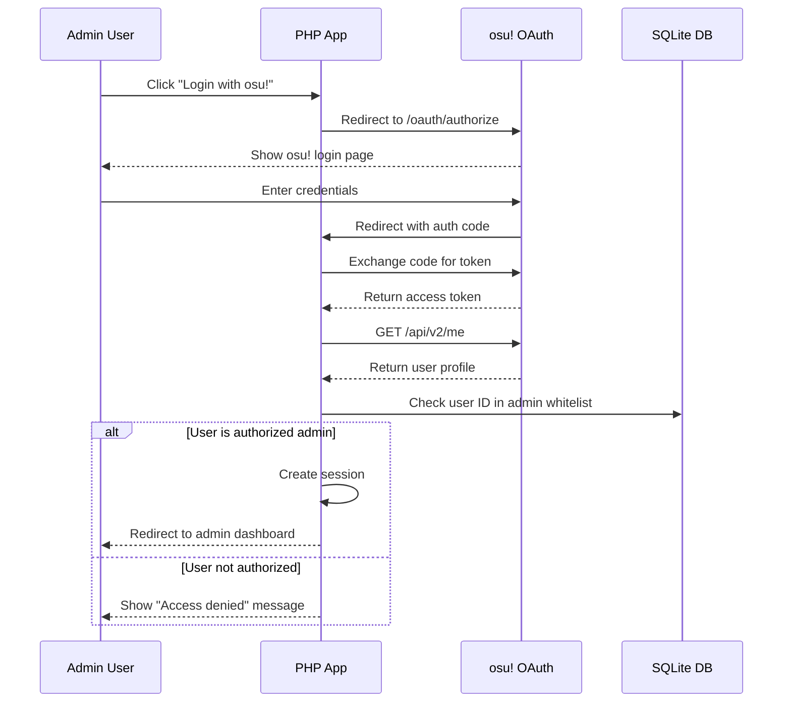

# Backend Architecture

## Service Architecture

### Traditional Server Architecture

#### Controller/Route Organization
```
src/
├── controllers/
│   ├── HomeController.php          # Homepage tournament display
│   ├── TournamentController.php    # Public tournament operations
│   ├── ApiController.php           # REST API endpoints
│   └── AdminController.php         # Admin panel operations
├── middleware/
│   ├── AuthMiddleware.php          # osu! OAuth verification
│   ├── CSRFMiddleware.php          # CSRF token validation
│   └── RateLimitMiddleware.php     # Basic rate limiting
└── routes/
    ├── web.php                     # Public web routes
    ├── api.php                     # API routes
    └── admin.php                   # Admin routes
```

#### Controller Template
```php
<?php
// TournamentController.php - Main tournament operations
class TournamentController {
    private $tournamentRepository;
    private $filterService;
    private $validationService;

    public function __construct(
        TournamentRepository $tournamentRepository,
        FilterService $filterService,
        ValidationService $validationService
    ) {
        $this->tournamentRepository = $tournamentRepository;
        $this->filterService = $filterService;
        $this->validationService = $validationService;
    }

    // Display all tournaments with filtering
    public function index() {
        $filters = $this->validationService->validateFilters($_GET);
        $tournaments = $this->tournamentRepository->findByFilters($filters);
        
        $data = [
            'tournaments' => $tournaments,
            'filters' => $filters,
            'total' => count($tournaments),
            'title' => 'osu! Tournament Discovery'
        ];
        
        return $this->renderTemplate('pages/tournaments-list.php', $data);
    }

    // API endpoint for AJAX requests
    public function api() {
        header('Content-Type: application/json; charset=utf-8');
        
        try {
            $filters = $this->validationService->validateFilters($_GET);
            $tournaments = $this->tournamentRepository->findByFilters($filters);
            
            // Convert timestamps to KST for Korean users
            $tournaments = array_map(function($tournament) {
                return $this->formatForKoreanTimezone($tournament);
            }, $tournaments);
            
            echo json_encode([
                'tournaments' => $tournaments,
                'total' => count($tournaments),
                'success' => true
            ], JSON_UNESCAPED_UNICODE);
        } catch (Exception $e) {
            http_response_code(500);
            echo json_encode([
                'error' => 'Failed to load tournaments',
                'success' => false
            ], JSON_UNESCAPED_UNICODE);
        }
    }

    // Korean timezone formatting
    private function formatForKoreanTimezone($tournament) {
        $tournament['created_at_kst'] = 
            DateHelper::convertToKST($tournament['created_at']);
        return $tournament;
    }

    // Template rendering with Korean character support
    private function renderTemplate($template, $data = []) {
        extract($data);
        ob_start();
        include "src/templates/{$template}";
        return ob_get_clean();
    }
}
?>
```

## Database Architecture

### Schema Design
```sql
-- Core tournament schema with Korean optimization
CREATE TABLE tournaments (
    id INTEGER PRIMARY KEY AUTOINCREMENT,
    topic_id INTEGER UNIQUE NOT NULL,
    title TEXT NOT NULL COLLATE NOCASE,
    host TEXT NOT NULL,
    mode TEXT NOT NULL,
    banner_url TEXT,
    rank_range TEXT NOT NULL,
    registration_status TEXT NOT NULL,
    -- Korean-specific fields
    language_detected TEXT NOT NULL DEFAULT 'en',
    parsed_terms_used TEXT, -- JSON array
    -- Timestamp fields in KST
    created_at TEXT NOT NULL DEFAULT CURRENT_TIMESTAMP,
    updated_at TEXT NOT NULL DEFAULT CURRENT_TIMESTAMP,
    status TEXT NOT NULL DEFAULT 'pending_review'
);

-- Cross-language term mapping
CREATE TABLE term_mappings (
    id INTEGER PRIMARY KEY AUTOINCREMENT,
    language TEXT NOT NULL, -- 'ko', 'ja', 'zh', 'ru', etc.
    foreign_term TEXT NOT NULL,
    english_concept TEXT NOT NULL,
    confidence REAL NOT NULL DEFAULT 1.0,
    usage_count INTEGER NOT NULL DEFAULT 1,
    created_at TEXT NOT NULL DEFAULT CURRENT_TIMESTAMP
);

-- Full-text search optimization for Korean
CREATE VIRTUAL TABLE tournaments_fts USING fts5(
    title, host, content='tournaments', content_rowid='id'
);
```

### Data Access Layer
```php
<?php
// Repository pattern with Korean language support
class TournamentRepository {
    private $db;
    
    public function __construct(DatabaseHelper $db) {
        $this->db = $db;
    }

    // Find tournaments with complex filtering
    public function findByFilters($filters = []) {
        $sql = "SELECT * FROM tournaments WHERE status = 'approved'";
        $params = [];

        // Mode filtering
        if (!empty($filters['mode'])) {
            $sql .= " AND mode = :mode";
            $params[':mode'] = $filters['mode'];
        }

        // Rank range filtering with Korean rank terms
        if (!empty($filters['rank_range'])) {
            $sql .= " AND rank_range LIKE :rank_range";
            $params[':rank_range'] = '%' . $filters['rank_range'] . '%';
        }

        // Korean text search support
        if (!empty($filters['search'])) {
            $sql .= " AND (title LIKE :search OR host LIKE :search)";
            $params[':search'] = '%' . $filters['search'] . '%';
        }

        // Order by creation date (KST)
        $sql .= " ORDER BY created_at DESC";
        
        // Pagination
        if (isset($filters['limit'])) {
            $sql .= " LIMIT :limit";
            $params[':limit'] = (int)$filters['limit'];
            
            if (isset($filters['offset'])) {
                $sql .= " OFFSET :offset";
                $params[':offset'] = (int)$filters['offset'];
            }
        }

        return $this->db->query($sql, $params);
    }

    // Korean language-aware tournament creation
    public function create($data) {
        $sql = "INSERT INTO tournaments (
            topic_id, title, host, mode, banner_url, rank_range,
            registration_status, language_detected, parsed_terms_used,
            created_at, updated_at
        ) VALUES (
            :topic_id, :title, :host, :mode, :banner_url, :rank_range,
            :registration_status, :language_detected, :parsed_terms_used,
            datetime('now', '+9 hours'), datetime('now', '+9 hours')
        )";

        return $this->db->execute($sql, [
            ':topic_id' => $data['topic_id'],
            ':title' => $data['title'],
            ':host' => $data['host'],
            ':mode' => $data['mode'],
            ':banner_url' => $data['banner_url'],
            ':rank_range' => $data['rank_range'],
            ':registration_status' => $data['registration_status'],
            ':language_detected' => $data['language_detected'] ?? 'en',
            ':parsed_terms_used' => json_encode($data['parsed_terms_used'] ?? [])
        ]);
    }
}
?>
```

## Authentication and Authorization

### Auth Flow


### Middleware/Guards
```php
<?php
// AuthMiddleware.php - osu! OAuth authentication
class AuthMiddleware {
    private $adminUserIds = [
        123456, // Main admin osu! user ID
        789012  // Secondary admin osu! user ID
    ];

    public function handle($request, $next) {
        session_start();

        // Check if user is authenticated
        if (!isset($_SESSION['osu_user_id'])) {
            return $this->redirectToLogin();
        }

        // Verify admin privileges
        if (!in_array($_SESSION['osu_user_id'], $this->adminUserIds)) {
            return $this->accessDenied();
        }

        // Update last activity
        $_SESSION['last_activity'] = time();

        return $next($request);
    }

    private function redirectToLogin() {
        $return_url = urlencode($_SERVER['REQUEST_URI']);
        header("Location: /admin/login.php?return={$return_url}");
        exit;
    }

    private function accessDenied() {
        http_response_code(403);
        include 'src/templates/errors/403.php';
        exit;
    }

    // CSRF protection for admin forms
    public function validateCSRF() {
        if ($_SERVER['REQUEST_METHOD'] === 'POST') {
            $token = $_POST['csrf_token'] ?? '';
            if (!hash_equals($_SESSION['csrf_token'] ?? '', $token)) {
                throw new SecurityException('CSRF token mismatch');
            }
        }
    }
}
?>
```
