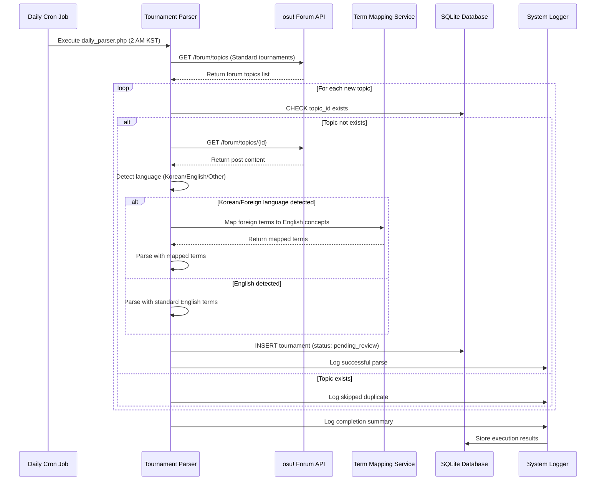
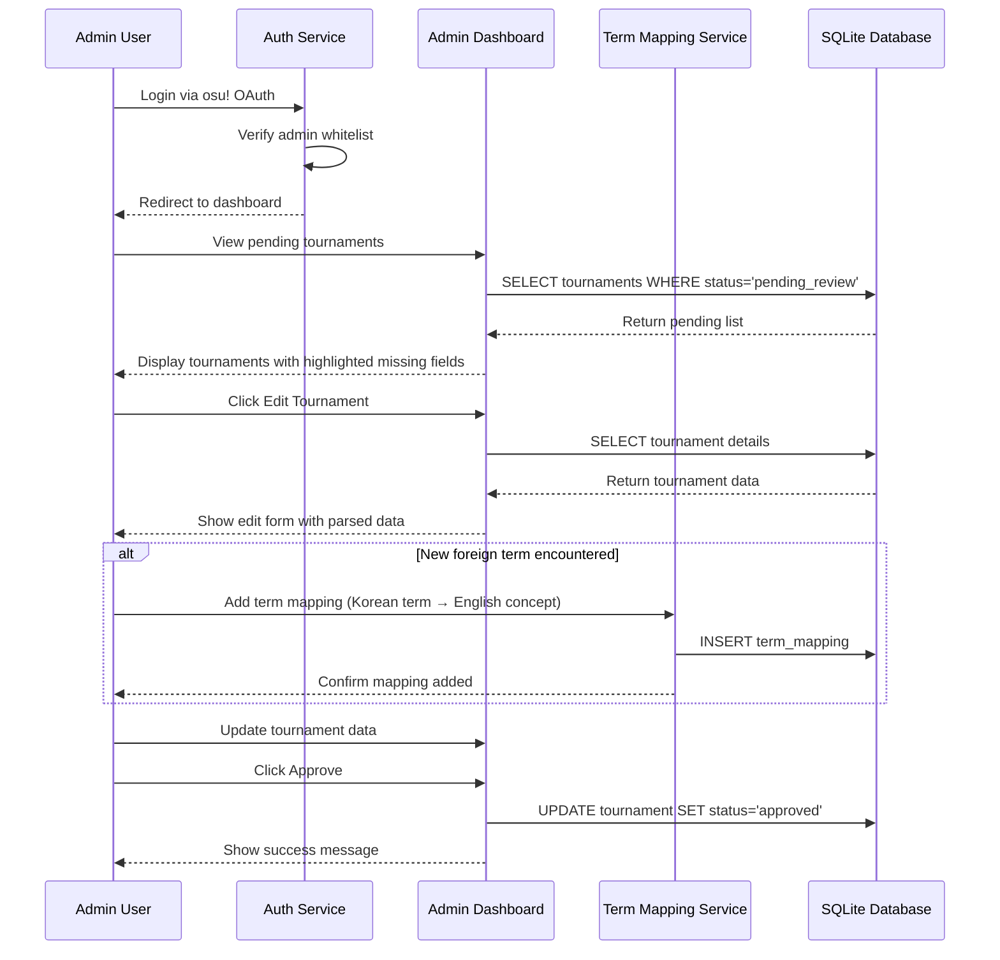
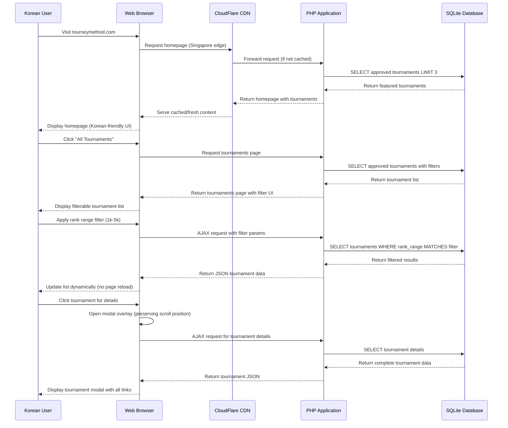

# Core Workflows

## Daily Tournament Parsing with Language Fallback

```mermaid
sequenceDiagram
    participant Cron as Daily Cron Job
    participant Parser as Tournament Parser
    participant API as osu! Forum API
    participant TermMap as Term Mapping Service
    participant DB as SQLite Database
    participant Log as System Logger

    Cron->>Parser: Execute daily_parser.php (2 AM KST)
    Parser->>API: GET /forum/topics (Standard tournaments)
    API-->>Parser: Return forum topics list
    
    loop For each new topic
        Parser->>DB: CHECK topic_id exists
        alt Topic not exists
            Parser->>API: GET /forum/topics/{id}
            API-->>Parser: Return post content
            Parser->>Parser: Detect language (Korean/English/Other)
            
            alt Korean/Foreign language detected
                Parser->>TermMap: Map foreign terms to English concepts
                TermMap-->>Parser: Return mapped terms
                Parser->>Parser: Parse with mapped terms
            else English detected
                Parser->>Parser: Parse with standard English terms
            end
            
            Parser->>DB: INSERT tournament (status: pending_review)
            Parser->>Log: Log successful parse
        else Topic exists
            Parser->>Log: Log skipped duplicate
        end
    end
    
    Parser->>Log: Log completion summary
    Log->>DB: Store execution results
```

## Admin Tournament Review and Term Mapping

```mermaid
sequenceDiagram
    participant Admin as Admin User
    participant Auth as Auth Service
    participant Dashboard as Admin Dashboard
    participant TermMap as Term Mapping Service
    participant DB as SQLite Database

    Admin->>Auth: Login via osu! OAuth
    Auth->>Auth: Verify admin whitelist
    Auth-->>Admin: Redirect to dashboard
    
    Admin->>Dashboard: View pending tournaments
    Dashboard->>DB: SELECT tournaments WHERE status='pending_review'
    DB-->>Dashboard: Return pending list
    Dashboard-->>Admin: Display tournaments with highlighted missing fields
    
    Admin->>Dashboard: Click Edit Tournament
    Dashboard->>DB: SELECT tournament details
    DB-->>Dashboard: Return tournament data
    Dashboard-->>Admin: Show edit form with parsed data
    
    alt New foreign term encountered
        Admin->>TermMap: Add term mapping (Korean term → English concept)
        TermMap->>DB: INSERT term_mapping
        TermMap-->>Admin: Confirm mapping added
    end
    
    Admin->>Dashboard: Update tournament data
    Admin->>Dashboard: Click Approve
    Dashboard->>DB: UPDATE tournament SET status='approved'
    Dashboard-->>Admin: Show success message
```

## Public Tournament Discovery Flow

```mermaid
sequenceDiagram
    participant User as Korean User
    participant Browser as Web Browser
    participant CDN as CloudFlare CDN
    participant App as PHP Application
    participant DB as SQLite Database

    User->>Browser: Visit tourneymethod.com
    Browser->>CDN: Request homepage (Singapore edge)
    CDN->>App: Forward request (if not cached)
    App->>DB: SELECT approved tournaments LIMIT 3
    DB-->>App: Return featured tournaments
    App-->>CDN: Return homepage with tournaments
    CDN-->>Browser: Serve cached/fresh content
    Browser-->>User: Display homepage (Korean-friendly UI)
    
    User->>Browser: Click "All Tournaments"
    Browser->>App: Request tournaments page
    App->>DB: SELECT approved tournaments with filters
    DB-->>App: Return tournament list
    App-->>Browser: Return tournaments page with filter UI
    Browser-->>User: Display filterable tournament list
    
    User->>Browser: Apply rank range filter (1k-5k)
    Browser->>App: AJAX request with filter params
    App->>DB: SELECT tournaments WHERE rank_range MATCHES filter
    DB-->>App: Return filtered results
    App-->>Browser: Return JSON tournament data
    Browser-->>User: Update list dynamically (no page reload)
    
    User->>Browser: Click tournament for details
    Browser->>Browser: Open modal overlay (preserving scroll position)
    Browser->>App: AJAX request for tournament details
    App->>DB: SELECT tournament details
    DB-->>App: Return complete tournament data
    App-->>Browser: Return tournament JSON
    Browser-->>User: Display tournament modal with all links
```
