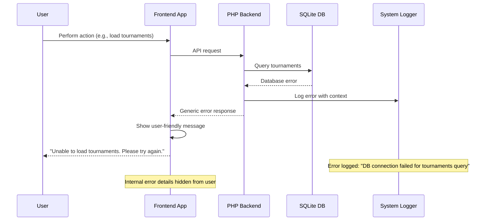

# Error Handling Strategy

## Error Flow


## Error Response Format
```typescript
interface ApiError {
  error: {
    code: string;          // "TOURNAMENT_NOT_FOUND", "DATABASE_ERROR"
    message: string;       // User-friendly message
    details?: Record<string, any>; // Debug info (development only)
    timestamp: string;     // KST timestamp
    requestId: string;     // Unique request identifier
  };
}
```

## Frontend Error Handling
```javascript
const ErrorHandler = {
    // Global error handling for AJAX requests
    handleApiError: function(xhr, status, error) {
        const response = xhr.responseJSON || {};
        const errorCode = response.error?.code || 'UNKNOWN_ERROR';
        
        // Log error for debugging (development only)
        if (window.DEBUG_MODE) {
            console.error('API Error:', response);
        }
        
        // Show user-friendly message
        const userMessage = this.getUserMessage(errorCode);
        this.showErrorModal(userMessage);
        
        // Track error for analytics
        this.trackError(errorCode, xhr.status);
    },

    // Convert error codes to Korean/English user messages
    getUserMessage: function(errorCode) {
        const messages = {
            'TOURNAMENT_NOT_FOUND': '토너먼트를 찾을 수 없습니다.',
            'DATABASE_ERROR': '일시적인 오류가 발생했습니다. 잠시 후 다시 시도해주세요.',
            'RATE_LIMIT_EXCEEDED': '요청이 너무 많습니다. 잠시 후 다시 시도해주세요.',
            'UNKNOWN_ERROR': '예상치 못한 오류가 발생했습니다.'
        };
        
        return messages[errorCode] || messages['UNKNOWN_ERROR'];
    },

    // Display error modal with retry option
    showErrorModal: function(message) {
        $('#error-modal .error-message').text(message);
        $('#error-modal').addClass('active');
    }
};
```

## Backend Error Handling
```php
<?php
class ErrorHandler {
    private $logger;
    
    public function __construct(SystemLog $logger) {
        $this->logger = $logger;
    }
    
    // Global exception handler
    public function handleException($exception) {
        // Log error with context
        $context = [
            'file' => $exception->getFile(),
            'line' => $exception->getLine(),
            'trace' => $exception->getTraceAsString(),
            'request_uri' => $_SERVER['REQUEST_URI'] ?? 'unknown',
            'user_agent' => $_SERVER['HTTP_USER_AGENT'] ?? 'unknown'
        ];
        
        $this->logger->error($exception->getMessage(), $context);
        
        // Return appropriate response
        if ($this->isApiRequest()) {
            $this->sendApiError($exception);
        } else {
            $this->sendHtmlError($exception);
        }
    }
    
    // Send JSON error response for API requests
    private function sendApiError($exception) {
        http_response_code($this->getHttpStatus($exception));
        header('Content-Type: application/json; charset=utf-8');
        
        $response = [
            'error' => [
                'code' => $this->getErrorCode($exception),
                'message' => $this->getUserMessage($exception),
                'timestamp' => date('c'), // ISO format with timezone
                'requestId' => $this->generateRequestId()
            ]
        ];
        
        // Include debug info in development
        if ($_ENV['DEBUG_MODE'] ?? false) {
            $response['error']['details'] = [
                'file' => $exception->getFile(),
                'line' => $exception->getLine()
            ];
        }
        
        echo json_encode($response, JSON_UNESCAPED_UNICODE);
    }
    
    // Convert exceptions to user-friendly messages
    private function getUserMessage($exception) {
        if ($exception instanceof ValidationException) {
            return '입력 데이터가 올바르지 않습니다.';
        }
        
        if ($exception instanceof DatabaseException) {
            return '일시적인 오류가 발생했습니다. 잠시 후 다시 시도해주세요.';
        }
        
        if ($exception instanceof AuthenticationException) {
            return '인증이 필요합니다.';
        }
        
        // Generic error message for unknown exceptions
        return '예상치 못한 오류가 발생했습니다.';
    }
    
    // Security exception handling with immediate response
    public function handleSecurityException($exception) {
        // Log security incident
        $this->logger->error('Security Exception: ' . $exception->getMessage(), [
            'ip_address' => $_SERVER['REMOTE_ADDR'] ?? 'unknown',
            'user_agent' => $_SERVER['HTTP_USER_AGENT'] ?? 'unknown',
            'request_data' => $_POST,
            'severity' => 'HIGH'
        ]);
        
        // Return 403 Forbidden
        http_response_code(403);
        exit('Access denied');
    }
}
?>
```
