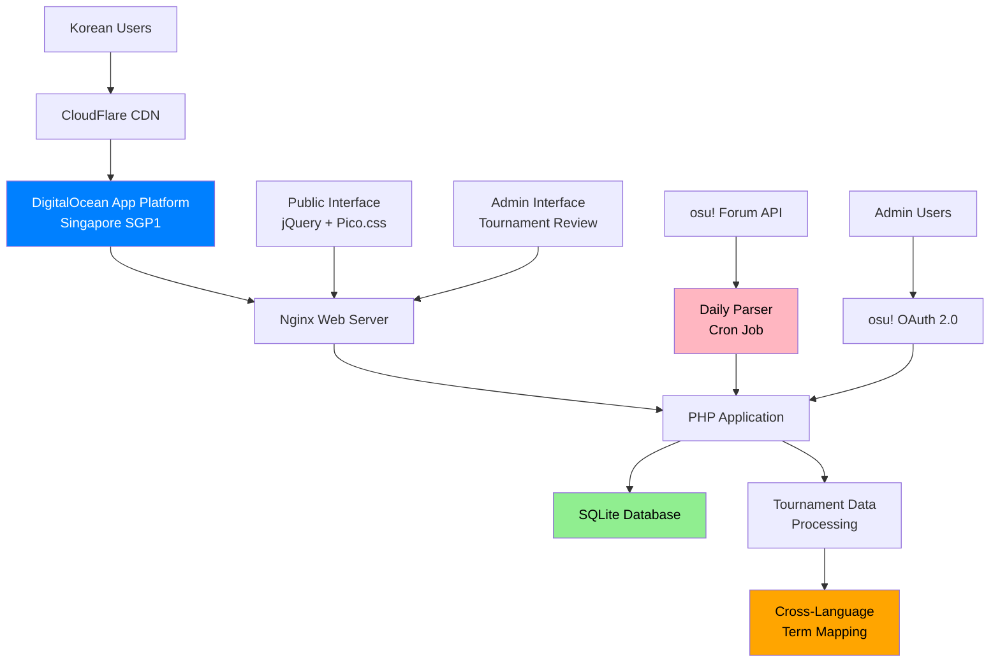

# High Level Architecture

## Technical Summary

Tourney Method is a traditional web application built with vanilla PHP and progressive enhancement, designed specifically for the Korean osu! tournament community. The architecture leverages DigitalOcean App Platform for managed deployment in Singapore, providing optimal latency for Korean users. The system integrates with osu! OAuth 2.0 for admin authentication and the osu! Forum API for automated tournament data parsing. 

The frontend uses jQuery with Pico.css for a lightweight, responsive experience that works across devices without heavy framework overhead. The backend implements a clean repository pattern with SQLite for data persistence, featuring advanced cross-language term mapping to handle tournaments posted in Korean, English, and other languages. This architecture achieves the PRD goals of automated tournament discovery, admin-curated data quality, and fast public tournament browsing for the Korean market.

## Platform and Infrastructure Choice

**Platform:** DigitalOcean App Platform
**Key Services:** Managed PHP runtime, Nginx web server, automatic SSL, built-in CDN, scheduled jobs
**Deployment Host and Regions:** Singapore (SGP1) for optimal Korean latency (30-60ms to Seoul/Busan)

**Platform Decision Rationale:**
- **Cost Efficiency:** $5/month vs $25/month for traditional droplet (60% savings)
- **Korean Market Optimization:** Singapore region provides best latency to Korea
- **Zero Server Management:** Automatic OS updates, security patches, scaling
- **Integrated Services:** SSL, CDN, monitoring, and scheduled jobs built-in
- **Git-based Deployment:** Direct deployment from GitHub repository

**Alternative Considered:** Traditional DigitalOcean droplet was rejected due to higher maintenance overhead and cost.

## Repository Structure

**Structure:** Monorepo with functional organization
**Monorepo Tool:** Native Git (no additional tooling required)
**Package Organization:** Functional separation (public/, src/, data/, config/, scripts/, tests/)

The monorepo approach simplifies development and deployment while maintaining clear separation of concerns through directory structure rather than separate repositories.

## High Level Architecture Diagram

## Architectural Patterns

- **Monolithic Architecture:** Single deployable unit with clear internal boundaries - _Rationale:_ Simplicity for solo developer, easy deployment and debugging, cost-effective for initial scale
- **Repository Pattern:** Abstract data access logic - _Rationale:_ Enables testing and future database migration flexibility from SQLite to PostgreSQL
- **Progressive Enhancement:** JavaScript enhances but doesn't replace core functionality - _Rationale:_ Accessibility, performance, and reliability for diverse user devices and network conditions
- **MVC Separation:** Clear separation of models, views, and controllers - _Rationale:_ Maintainability and organization despite not using a formal MVC framework
- **Service Layer Pattern:** Business logic encapsulated in service classes - _Rationale:_ Testability and reusability of core application logic
- **Cross-Language Processing:** Admin-managed term mapping for international tournaments - _Rationale:_ Handles Korean/English/multilingual tournament posts without AI/ML complexity
