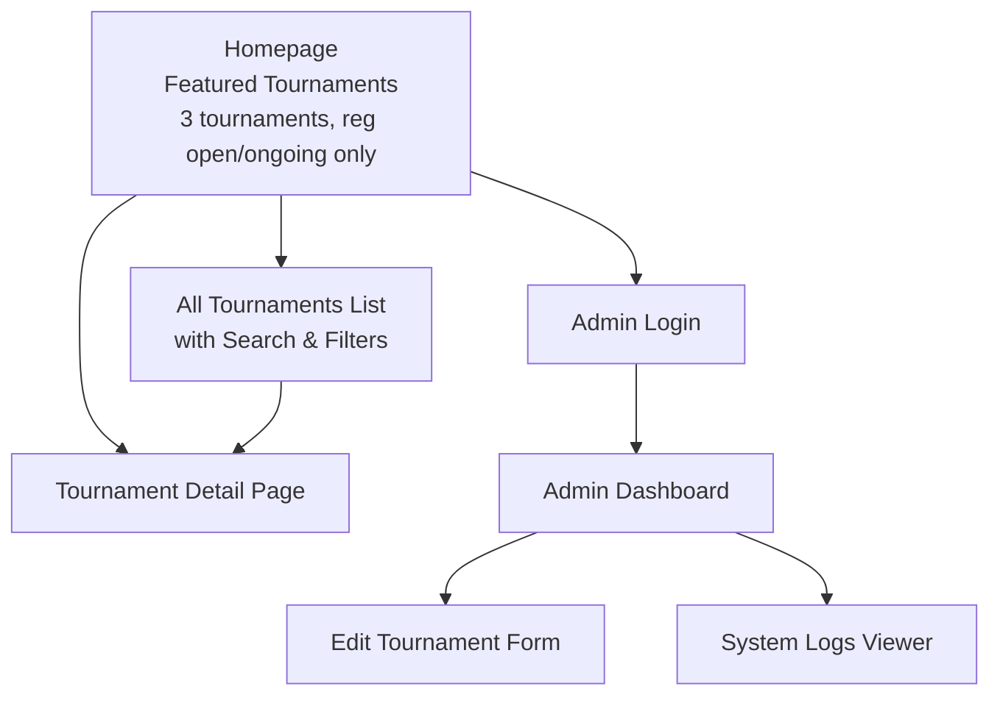
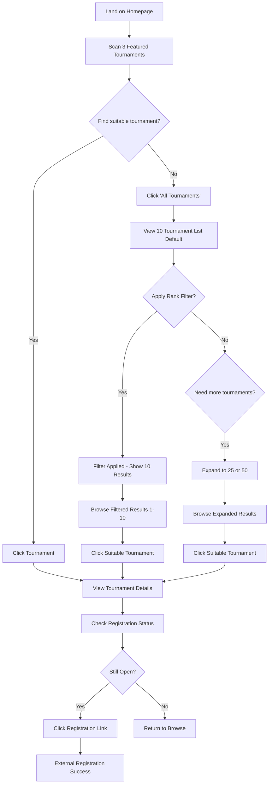
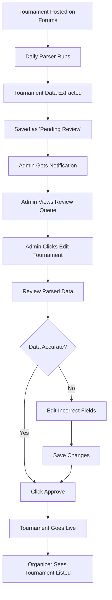
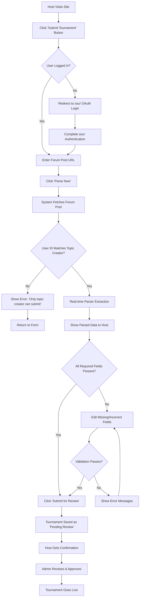

# Tourney Method UI/UX Specification

This document defines the user experience goals, information architecture, user flows, and visual design specifications for Tourney Method's user interface. It serves as the foundation for visual design and frontend development, ensuring a cohesive and user-centered experience.

## Overall UX Goals & Principles

### Target User Personas

**Competitive Players:** osu! players of all skill levels (1k-5k+ ranks) who actively compete and need efficient tournament discovery

**Tournament Organizers:** Volunteer community members who create/manage tournaments and need visibility

**Site Administrator:** Admin who reviews/approves parsed tournament data

### Usability Goals

- **Speed:** Core tasks completable within seconds, not minutes
- **Simplicity:** No learning curve - intuitive for existing osu! community members
- **Reliability:** Consistent, accurate tournament information discovery
- **Mobile-friendly:** Fully functional on both desktop and mobile browsers

### Design Principles

1. **Filter-first interaction** - Primary UI paradigm with rank-based filtering (Open, 100+, 500+, 1k+, 5k+, 10k+ for starting rank ranges)
2. **Lightweight performance** - Fast loading on low-resource infrastructure  
3. **Community-focused** - Design for osu! players' mental models and rank-based tournament categorization
4. **Accessibility by default** - WCAG 2.1 AA compliance
5. **Progressive enhancement** - Works without JavaScript, enhanced with it

### Change Log

| Date | Version | Description | Author |
| :--- | :--- | :--- | :--- |
| 2025-09-04 | 1.0 | Initial draft | Sally (UX Expert) |

## Information Architecture (IA)

### Site Map / Screen Inventory

### Navigation Structure

**Primary Navigation:** 
- Logo/Home link (Tourney Method) 
- "All Tournaments" link (prominent CTA from homepage)
- Admin Login link (small, unobtrusive)

**Homepage Structure:** Clean landing page with brief site description, featured section showing exactly 3 tournaments (registration open/ongoing only), and clear "View All Tournaments" call-to-action button

**All Tournaments Page:** Full discovery interface with search bar, filter controls (Rank Range: Open, 100+, 500+, 1k+, 5k+, 10k+, Registration Status, Game Mode), and complete tournament listings

**Breadcrumb Strategy:** Minimal breadcrumbs only where needed:
- Tournament Detail: "Home > [Tournament Name]" or "All Tournaments > [Tournament Name]"
- Admin areas: "Admin > Dashboard/Logs/Edit"

## User Flows

### Flow 1: Quick Tournament Discovery (Casual Player)

**User Goal:** Find an open tournament I can join right now

**Entry Points:** Direct homepage visit, social media links, word-of-mouth

**Success Criteria:** Player finds and accesses registration for a suitable tournament within 60 seconds

#### Flow Diagram

#### Edge Cases & Error Handling:
- No tournaments in first 10 results → Show "Load More" or "Expand to 25/50" options prominently
- Filter returns 0 results → "No tournaments found. Try different filters or view all tournaments"
- Performance on 50 tournament view → Ensure fast loading even on mobile/low bandwidth
- Registration link is broken → Show error message with forum link as backup
- All featured tournaments have closed registration → Display "View All Tournaments" prominently

#### Notes:
The pagination approach (10 → 25 → 50) balances performance with discovery needs. Most users will find what they need in the first 10, but power users can expand as needed without impacting initial page load.

### Flow 2: Tournament Organizer Verification (Admin)

**User Goal:** Ensure tournament data is accurate and publish it to the platform

**Entry Points:** Admin notification of new parsed tournament, periodic checking

**Success Criteria:** Tournament data is verified and published within 24 hours of forum posting

#### Flow Diagram

#### Edge Cases & Error Handling:
- Parser fails to extract key data → Fields highlighted in red for admin attention
- Tournament format not recognized → Admin manually categorizes
- Duplicate tournament detected → System prevents duplicate, shows existing entry
- Admin unavailable for 48+ hours → Backup notification system

### Flow 3: Manual Tournament Submission (Authenticated Organizer)

**User Goal:** Submit my tournament immediately as the verified topic creator

**Entry Points:** "Submit Tournament" button (requires login)

**Success Criteria:** Verified tournament creator submits accurate data within 5 minutes

#### Flow Diagram

#### Edge Cases & Error Handling:
- User ID doesn't match topic creator → "Only the tournament organizer who created the forum post can submit this tournament"
- Authentication fails → Redirect to login with return URL
- Topic creator tries to submit duplicate → "This tournament is already submitted/live"
- Forum post doesn't exist/is private → "Unable to access forum post. Please check URL and permissions"

#### Authentication Requirements:
- **osu! OAuth Login Required:** User must authenticate with osu! account
- **Topic Creator Verification:** System verifies authenticated user ID matches forum post creator ID
- **Session Management:** Maintain login session for form completion

## Wireframes & Mockups

**Primary Design Files:** To be created in Figma/Sketch - focusing on mobile-first responsive layouts with light/dark theme support

### Key Screen Layouts

#### Homepage Layout
**Purpose:** Fast tournament discovery with immediate actionable options

**Key Elements:**
- Clean header with Tourney Method logo and "All Tournaments" CTA
- Brief site description (1-2 sentences)  
- Featured tournaments section (exactly 3 tournaments, cards/table format)
- Prominent "Submit Tournament" button for organizers
- "View All Tournaments" call-to-action

**Interaction Notes:** Tournament titles click to open forum posts in new tabs. Tournament card/row areas click to open modal dialogs. Mobile-first design with clear visual distinction between title links and clickable card areas.

**Design File Reference:** Homepage - Mobile & Desktop variants with modal trigger areas

#### All Tournaments Page Layout  
**Purpose:** Comprehensive tournament discovery with filtering and modal previews

**Key Elements:**
- Search bar (prominent, top placement)
- Filter sidebar/panel (Rank Range: Open, 100+, 500+, 1k+, 5k+, 10k+, Registration Status, Game Mode)
- Tournament list/table with clear title links (10 default, expand to 25/50)
- Pagination controls ("Show more" buttons)
- Clear filter/reset options

**Interaction Notes:** Tournament titles open forum posts in new tabs. Tournament rows/cards open modal dialogs preserving scroll position. Filters applied instantly without page reload. Mobile version collapses filters into dropdown/modal.

**Design File Reference:** All Tournaments - Filter states, pagination variants, modal overlay states

#### Tournament Detail Modal/Dialog
**Purpose:** Show full tournament information without breaking browsing flow

**Key Elements:**
- Modal overlay with tournament banner as header
- Scrollable modal content (banner, title, structured data, links)
- Clear close button (X) and ESC key support
- Background page remains visible with scroll position preserved
- Mobile-optimized modal (full screen on small devices)

**Interaction Notes:** Tournament titles within modal still open forum posts in new tabs. All external links (registration, Discord, streams) open in new tabs. Modal close returns to exact scroll position. URL hash updates for bookmarking. Keyboard navigation support.

**Design File Reference:** Tournament Modal - Desktop overlay, mobile full-screen, loading states

## Component Library / Design System

**Design System Approach:** Leverage Pico.css as the foundation with minimal custom components. Build a small, focused component library that extends Pico.css for tournament-specific needs while maintaining lightweight performance.

### Core Components

#### Tournament Card
**Purpose:** Display tournament summary information in lists and featured sections

**Variants:**
- Featured card (homepage, larger with prominent CTA)
- List item (All Tournaments page, compact row format)
- Search result (with highlighted search terms)

**States:** Default, hover, loading (skeleton), error (broken banner/data)

**Usage Guidelines:** Always include rank range and registration status. Banner images optional with graceful fallbacks. Click areas clearly distinguished between title (external) and card (modal).

#### Filter Panel
**Purpose:** Provide efficient tournament filtering capabilities

**Variants:**
- Desktop sidebar (persistent, expanded)
- Mobile dropdown/modal (collapsible)
- Applied filters display (chips/tags showing active filters)

**States:** Default, expanded, collapsed, loading, error (no results)

**Usage Guidelines:** Filters apply instantly without page refresh. Clear visual feedback for active filters. Reset/clear all option always available.

#### Tournament Modal
**Purpose:** Display detailed tournament information without navigation

**Variants:**
- Desktop overlay (partial screen with background visible)
- Mobile full-screen (maximizes content space)
- Loading state (skeleton content)

**States:** Opening, open, closing, error (failed to load data)

**Usage Guidelines:** Always preserve scroll position on close. Banner images load lazily. External links clearly indicated with icons.

## Branding & Style Guide

### Visual Identity
**Brand Guidelines:** No formal branding required - clean, modern aesthetic guided by Pico.css framework principles

### Color Palette

| Color Type | Hex Code | Usage |
| :--- | :--- | :--- |
| Primary | #007bff | CTA buttons, links, active filters |
| Secondary | #6c757d | Secondary text, inactive elements |
| Accent | #28a745 | Registration Open status, success states |
| Success | #28a745 | Positive feedback, confirmations |
| Warning | #ffc107 | Registration Closing Soon, cautions |
| Error | #dc3545 | Registration Closed, errors, destructive actions |
| Neutral | #f8f9fa, #e9ecef, #6c757d | Text, borders, backgrounds |

### Typography

#### Font Families
- **Primary:** System font stack (Pico.css default) - optimized for performance
- **Secondary:** System font stack fallbacks
- **Monospace:** System monospace for technical data (tournament IDs, etc.)

#### Type Scale
| Element | Size | Weight | Line Height |
| :--- | :--- | :--- | :--- |
| H1 | 2rem | 600 | 1.2 |
| H2 | 1.5rem | 600 | 1.3 |
| H3 | 1.25rem | 600 | 1.4 |
| Body | 1rem | 400 | 1.5 |
| Small | 0.875rem | 400 | 1.4 |

### Iconography
**Icon Library:** Minimal icon usage - prefer text labels. When needed, use simple SVG icons for external links, filters, and modal controls

**Usage Guidelines:** Icons always accompanied by text labels for accessibility. External link icon for forum/registration links. Filter and close icons for UI controls.

### Spacing & Layout
**Grid System:** Pico.css container system with responsive breakpoints

**Spacing Scale:** 0.5rem base unit (8px) - 0.5rem, 1rem, 1.5rem, 2rem, 3rem

## Accessibility Requirements

### Compliance Target
**Standard:** WCAG 2.1 AA compliance to ensure usability by as many people as possible

### Key Requirements

**Visual:**
- Color contrast ratios: 4.5:1 minimum for normal text, 3:1 for large text
- Focus indicators: Clear, visible focus outlines on all interactive elements
- Text sizing: Minimum 16px body text, scalable to 200% without horizontal scrolling

**Interaction:**
- Keyboard navigation: All functionality accessible via keyboard, logical tab order
- Screen reader support: Semantic HTML, ARIA labels, descriptive link text
- Touch targets: Minimum 44px tap targets for mobile devices

**Content:**
- Alternative text: Descriptive alt text for tournament banners and icons
- Heading structure: Logical H1-H6 hierarchy for screen reader navigation
- Form labels: Clear, associated labels for all form controls

### Testing Strategy
**Automated Testing:** Integration with accessibility testing tools during development

**Manual Testing:** Keyboard-only navigation, screen reader testing (NVDA/JAWS), color contrast verification, mobile touch target testing, text scaling validation (up to 200%)

## Responsiveness Strategy

### Breakpoints

| Breakpoint | Min Width | Max Width | Target Devices |
| :--- | :--- | :--- | :--- |
| Mobile | 320px | 767px | Phones, small tablets |
| Tablet | 768px | 1023px | Tablets, small laptops |
| Desktop | 1024px | 1439px | Laptops, desktop monitors |
| Wide | 1440px | - | Large monitors, ultrawide displays |

### Adaptation Patterns

**Layout Changes:**
- Mobile: Single column layout, stacked filters, full-screen modals
- Tablet: Two-column layout where appropriate, collapsible filter sidebar
- Desktop: Multi-column layout, persistent filter sidebar, overlay modals
- Wide: Constrained content width, enhanced whitespace

**Navigation Changes:**
- Mobile: Hamburger menu for secondary nav, bottom-up filter panels
- Tablet: Horizontal navigation with dropdowns
- Desktop: Full horizontal navigation, sidebar filters
- Wide: Same as desktop with enhanced spacing

**Content Priority:**
- Mobile: Essential tournament info only, progressive disclosure
- Tablet: More tournament details visible, expanded cards
- Desktop: Full tournament information, multiple tournaments visible
- Wide: Enhanced information density, larger tournament banners

**Interaction Changes:**
- Mobile: Touch-optimized controls, swipe gestures, full-screen interactions
- Tablet: Mixed touch/mouse interactions, larger touch targets
- Desktop: Mouse-optimized hover states, keyboard shortcuts
- Wide: Enhanced hover states, additional keyboard shortcuts

## Performance Considerations

### Performance Goals
- **Page Load:** < 2 seconds on standard internet connection
- **Interaction Response:** < 100ms for filter applications and modal opens
- **Animation FPS:** 60fps for smooth micro-interactions and transitions

### Design Strategies

**Image Optimization:**
- Tournament banners lazy-loaded only when needed
- WebP format with fallbacks for better compression
- Responsive image sizing for different breakpoints
- Placeholder/skeleton loading states

**Code Efficiency:**
- Minimal JavaScript - progressive enhancement approach
- CSS optimized for reusability and minimal specificity
- Component-based architecture reduces code duplication
- Critical CSS inlined for faster initial render

**Data Loading:**
- Default 10 tournaments minimizes initial payload
- Pagination (25/50) loads additional content on demand
- Filter results cached for instant re-application
- Modal content loaded only when opened

**Network Optimization:**
- Minimize HTTP requests through careful asset bundling
- Leverage browser caching for static assets
- Compress text assets (HTML, CSS, JS)
- CDN considerations for global accessibility

## Next Steps

### Immediate Actions

1. **Create detailed wireframes/mockups** in Figma for Homepage, All Tournaments, and Tournament Modal layouts
2. **Validate rank filter categories** with osu! community feedback to ensure the Open, 100+, 500+, 1k+, 5k+, 10k+ ranges match real tournament patterns
3. **Set up Pico.css foundation** and create initial component library structure
4. **Establish accessibility testing workflow** with automated tools integration
5. **Design tournament banner loading and fallback strategies** for optimal performance

### Design Handoff Checklist

- [x] All user flows documented with modal interaction patterns
- [x] Component inventory complete with Tournament Card, Filter Panel, and Modal components  
- [x] Accessibility requirements defined (WCAG 2.1 AA compliance)
- [x] Responsive strategy clear with mobile-first approach
- [x] Brand guidelines incorporated (minimalist Pico.css approach)
- [x] Performance goals established (< 2s load, < 100ms interactions)
- [ ] Detailed wireframes created in design tool
- [ ] Component specifications finalized for development handoff
- [ ] User testing plan established for community validation