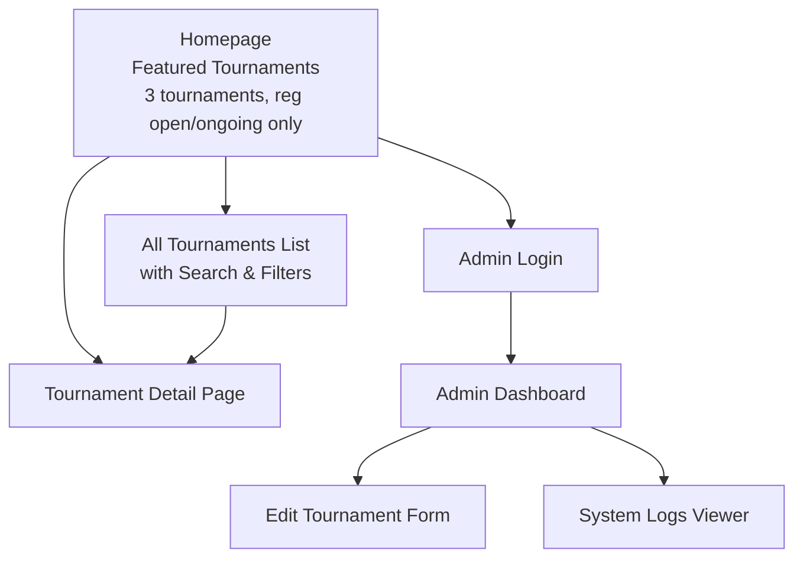

# Information Architecture (IA)

## Site Map / Screen Inventory

## Navigation Structure

**Primary Navigation:** 
- Logo/Home link (Tourney Method) 
- "All Tournaments" link (prominent CTA from homepage)
- Admin Login link (small, unobtrusive)

**Homepage Structure:** Clean landing page with brief site description, featured section showing exactly 3 tournaments (registration open/ongoing only), and clear "View All Tournaments" call-to-action button

**All Tournaments Page:** Full discovery interface with search bar, filter controls (Rank Range: Open, 100+, 500+, 1k+, 5k+, 10k+, Registration Status, Game Mode), and complete tournament listings

**Breadcrumb Strategy:** Minimal breadcrumbs only where needed:
- Tournament Detail: "Home > [Tournament Name]" or "All Tournaments > [Tournament Name]"
- Admin areas: "Admin > Dashboard/Logs/Edit"
