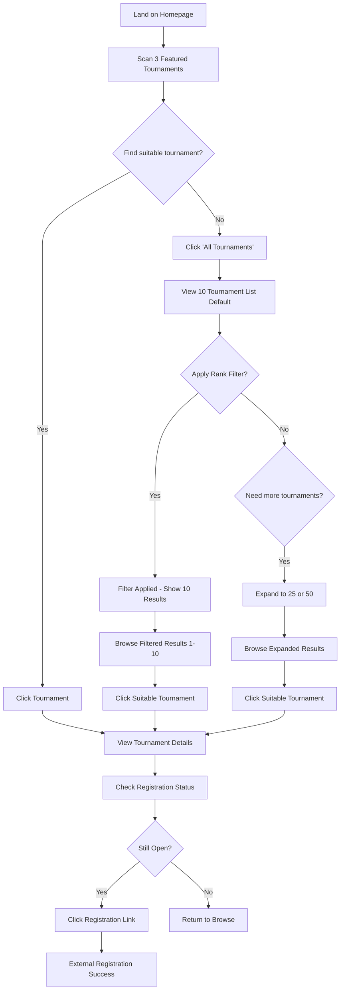
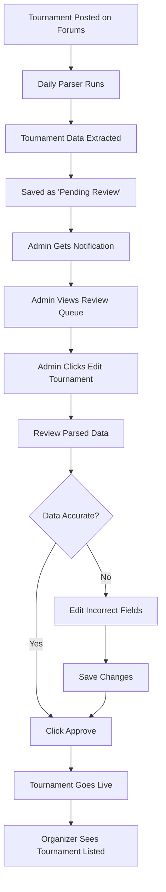
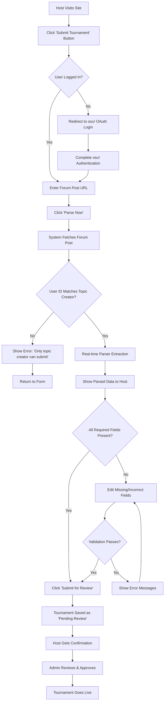

# User Flows

## Flow 1: Quick Tournament Discovery (Casual Player)

**User Goal:** Find an open tournament I can join right now

**Entry Points:** Direct homepage visit, social media links, word-of-mouth

**Success Criteria:** Player finds and accesses registration for a suitable tournament within 60 seconds

### Flow Diagram

### Edge Cases & Error Handling:
- No tournaments in first 10 results → Show "Load More" or "Expand to 25/50" options prominently
- Filter returns 0 results → "No tournaments found. Try different filters or view all tournaments"
- Performance on 50 tournament view → Ensure fast loading even on mobile/low bandwidth
- Registration link is broken → Show error message with forum link as backup
- All featured tournaments have closed registration → Display "View All Tournaments" prominently

### Notes:
The pagination approach (10 → 25 → 50) balances performance with discovery needs. Most users will find what they need in the first 10, but power users can expand as needed without impacting initial page load.

## Flow 2: Tournament Organizer Verification (Admin)

**User Goal:** Ensure tournament data is accurate and publish it to the platform

**Entry Points:** Admin notification of new parsed tournament, periodic checking

**Success Criteria:** Tournament data is verified and published within 24 hours of forum posting

### Flow Diagram

### Edge Cases & Error Handling:
- Parser fails to extract key data → Fields highlighted in red for admin attention
- Tournament format not recognized → Admin manually categorizes
- Duplicate tournament detected → System prevents duplicate, shows existing entry
- Admin unavailable for 48+ hours → Backup notification system

## Flow 3: Manual Tournament Submission (Authenticated Organizer)

**User Goal:** Submit my tournament immediately as the verified topic creator

**Entry Points:** "Submit Tournament" button (requires login)

**Success Criteria:** Verified tournament creator submits accurate data within 5 minutes

### Flow Diagram

### Edge Cases & Error Handling:
- User ID doesn't match topic creator → "Only the tournament organizer who created the forum post can submit this tournament"
- Authentication fails → Redirect to login with return URL
- Topic creator tries to submit duplicate → "This tournament is already submitted/live"
- Forum post doesn't exist/is private → "Unable to access forum post. Please check URL and permissions"

### Authentication Requirements:
- **osu! OAuth Login Required:** User must authenticate with osu! account
- **Topic Creator Verification:** System verifies authenticated user ID matches forum post creator ID
- **Session Management:** Maintain login session for form completion
