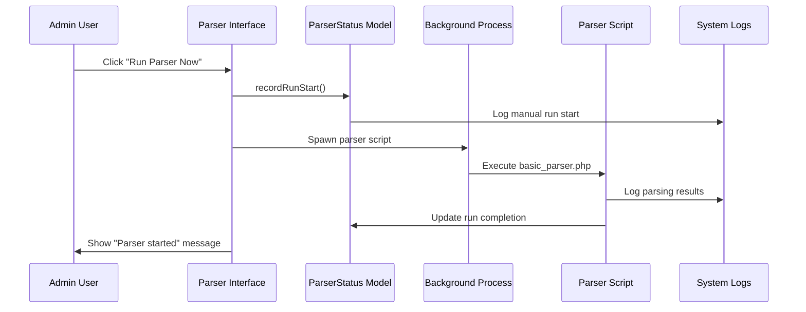

# Story 1.9: Parser Management Interface

## Status
Done

## Story
**As a** Site Administrator, 
**I want** To control the parser schedule and monitor parsing activity,
**so that** I can manage automated data collection and troubleshoot parsing issues.

## Acceptance Criteria
1. A protected admin page "/admin/parser.php" displays parser status and controls.
2. Shows last run time, next scheduled run, and recent parsing statistics.
3. Includes manual "Run Parser Now" button for immediate execution.
4. Allows toggling parser activation (active/paused) for maintenance.
5. Displays recent parsing activity log with success/failure counts.

## Tasks / Subtasks

- [x] Create ParserStatus Model (AC: 1, 2, 4, 5)
  - [x] Create `src/Models/ParserStatus.php` with parser state management
  - [x] Implement parser status table creation and initialization
  - [x] Add `getCurrentStatus()` method with next run calculation
  - [x] Add `updateStatus()` method with run tracking and statistics
  - [x] Include parser enable/disable and schedule management methods

- [x] Build Parser Status Tracking (AC: 2, 5)
  - [x] Add `recordRunStart()`, `recordRunSuccess()`, and `recordRunFailure()` methods
  - [x] Implement `getStatistics()` method for success rates and run counts
  - [x] Add `getRecentRuns()` method for activity log integration
  - [x] Include atomic counter increments for run statistics
  - [x] Support cron schedule parsing and next run calculation

- [x] Create Parser Management Page (AC: 1, 3, 4)
  - [x] Create `public/admin/parser.php` with admin authentication protection
  - [x] Implement parser control actions (toggle, schedule update, manual run)
  - [x] Add manual parser execution with background process handling
  - [x] Include CSRF protection for all parser control operations
  - [x] Add comprehensive error handling and status logging

- [x] Build Parser Management Template (AC: 1, 2, 3, 4, 5)
  - [x] Create `src/templates/admin/parser-management.php` with Korean interface
  - [x] Implement parser status overview with visual status indicators
  - [x] Add parser statistics dashboard with success rates and run counts
  - [x] Create parser control panel with toggle, manual run, and schedule controls
  - [x] Include recent activity log with detailed run information

- [x] Add Parser Control Operations (AC: 3, 4)
  - [x] Implement manual parser execution with background process spawning
  - [x] Add parser enable/disable toggle with confirmation dialogs
  - [x] Create schedule management with preset options (daily, 6-hour, 12-hour, weekly)
  - [x] Include parser status change logging for admin audit trail
  - [x] Add real-time status updates and page refresh for running parser

- [x] Integrate with Existing Parser System (Integration)
  - [x] Reference existing parser script (`scripts/parser/basic_parser.php`)
  - [x] Create parser_status table initialization on first access
  - [x] Integrate with system_logs for parser activity tracking
  - [x] Support Windows and Unix process spawning for manual execution
  - [x] Add cron expression validation and next run calculation

## Dev Notes

### Implementation Context
This story addresses the broken admin navigation link to `/admin/parser.php` by creating a comprehensive parser management and monitoring interface. It provides admin control over the automated tournament parsing system referenced in the architecture documentation.

### Parser Status Management
**Parser Status Database Table** (Auto-created):
```sql
CREATE TABLE parser_status (
    id INTEGER PRIMARY KEY AUTOINCREMENT,
    status TEXT NOT NULL DEFAULT 'active',
    last_run DATETIME,
    next_run DATETIME,
    last_success DATETIME,
    last_error DATETIME,
    total_runs INTEGER DEFAULT 0,
    successful_runs INTEGER DEFAULT 0,
    failed_runs INTEGER DEFAULT 0,
    current_run_pid INTEGER,
    schedule_interval TEXT DEFAULT '0 2 * * *',
    is_enabled BOOLEAN DEFAULT 1,
    created_at DATETIME DEFAULT CURRENT_TIMESTAMP,
    updated_at DATETIME DEFAULT CURRENT_TIMESTAMP
);
```

### Parser Status States
- `active` - Parser is enabled and ready for scheduled runs
- `paused` - Parser is disabled/paused by admin
- `running` - Parser is currently executing
- `error` - Parser encountered an error during last run

### Schedule Management
**Supported Cron Schedules**:
- `0 2 * * *` - Daily at 2 AM KST (default)
- `0 */6 * * *` - Every 6 hours
- `0 */12 * * *` - Every 12 hours  
- `0 0 * * 0` - Weekly on Sundays at midnight

### Technology Stack Integration
- **Backend**: Vanilla PHP 8.1+ with new ParserStatus model
- **Frontend**: Pico.css styling with JavaScript controls
- **Database**: SQLite with auto-created parser_status table
- **Process Management**: Cross-platform background process spawning
- **Integration**: Links to existing parser script and system logging

### File Structure Created
```
public/admin/parser.php                      # Main parser management page
src/Models/ParserStatus.php                  # Parser status tracking model
src/templates/admin/parser-management.php    # Management interface template
```

### Integration with Existing Systems
- **Parser Script**: References existing `scripts/parser/basic_parser.php`
- **System Logs**: Uses existing SystemLog model for activity tracking
- **Admin Authentication**: Protected by existing SecurityHelper
- **Korean Timezone**: Uses existing DateHelper for KST formatting

### Security Implementation
- **Admin Authentication**: Protected by existing SecurityHelper::requireAdminAuth()
- **CSRF Protection**: All control forms include CSRF tokens
- **Process Security**: Safe command execution with proper escaping
- **Status Change Logging**: All parser control actions logged to system_logs
- **Input Validation**: Schedule expressions validated before updating

### Korean Language Features
- **Interface**: All labels, buttons, and status messages in Korean
- **Status Indicators**: Korean labels for parser states (활성, 일시정지, 실행중, 오류)
- **Control Labels**: Korean control buttons (활성화, 일시정지, 지금 실행)
- **Statistics**: Korean labels for success rates and run counts
- **Schedule Options**: Korean descriptions for cron schedule presets

### Performance and Reliability Features
- **Background Execution**: Manual parser runs execute in background without blocking UI
- **Status Monitoring**: Real-time status updates with auto-refresh during parser runs
- **Statistics Caching**: Efficient calculation of success rates and run averages
- **Cross-Platform**: Works on both Windows and Unix systems for process spawning
- **Error Recovery**: Comprehensive error handling with status recovery

### Parser Integration Architecture


## Testing
**Testing Requirements**:
- **Parser Controls**: Test enable/disable, manual run, and schedule updates
- **Status Tracking**: Verify parser status updates and statistics accuracy
- **Background Execution**: Confirm manual parser runs execute without blocking
- **Security Testing**: Verify admin-only access and CSRF protection
- **Cross-Platform**: Test process spawning on Windows and Unix systems
- **Log Integration**: Confirm parser activities appear in system logs

## Change Log

| Date | Version | Description | Author |
|------|---------|-------------|--------|
| 2025-09-09 | 1.0 | Story 1.9 implementation - parser management and monitoring interface | Development Team |

## Dev Agent Record

### Implementation Summary
✅ **ParserStatus Model**: Complete parser state management with statistics and scheduling
✅ **Management Interface**: Korean-localized parser control dashboard with real-time updates
✅ **Control Operations**: Manual execution, enable/disable, and schedule management
✅ **Activity Monitoring**: Integration with system logs and recent run tracking
✅ **Cross-Platform**: Background process spawning for Windows and Unix systems
✅ **Security**: Admin-only access with CSRF protection and action logging

### File List
**New Files Created:**
- `src/Models/ParserStatus.php` - Parser status tracking and control model
- `public/admin/parser.php` - Protected admin parser management page
- `src/templates/admin/parser-management.php` - Korean parser management interface

**Integration Points:**
- Integrates with existing SecurityHelper for admin authentication
- References existing parser script (`scripts/parser/basic_parser.php`)
- Uses existing SystemLog model for activity tracking
- Uses existing DateHelper for KST timezone formatting
- Compatible with existing admin layout template structure

### Key Design Decisions
1. **Auto-Table Creation**: ParserStatus model creates its own table on first access for clean installation
2. **Background Execution**: Manual parser runs use background processes to prevent UI blocking
3. **Cross-Platform Support**: Different command syntax for Windows vs Unix process spawning
4. **Real-Time Updates**: Page auto-refreshes every 30 seconds when parser is running
5. **Comprehensive Logging**: All parser control actions logged to system_logs for audit trail
6. **Schedule Presets**: Common cron schedules provided as dropdown options for easy selection

### Performance Considerations
- **Efficient Status Queries**: Single query to get current parser state and calculate statistics
- **Background Processing**: Manual runs don't impact admin interface responsiveness
- **Statistics Optimization**: Success rates calculated efficiently with existing run counters
- **Log Integration**: Recent runs limited to 15 entries to prevent excessive data loading